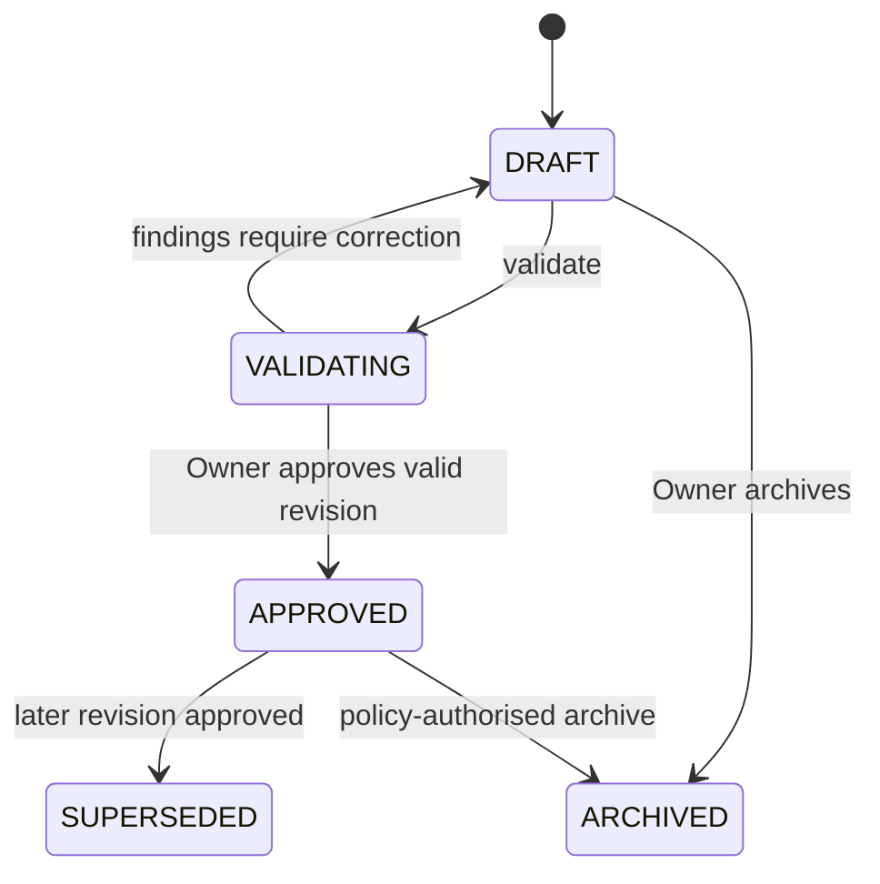
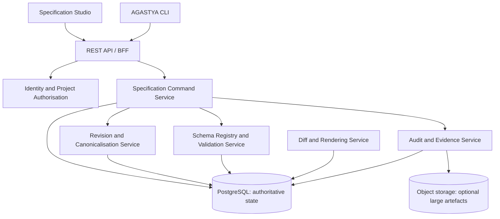

# SPEC-PLATFORM-001 — Canonical Specification Core

| Field | Value |
|---|---|
| **Status** | **APPROVED** — approved by the Project Sponsor on 2026-08-24T16:44:57Z |
| **Specification version** | `1.0.0` |
| **Schema version** | `1.0.0` |
| **Priority** | P0 / Critical |
| **Owning bounded context** | Specification Management |
| **Primary outcome** | A project-scoped, versioned, validated, approved, immutable and auditable source of engineering intent. |
| **Approval record** | `APPROVAL-SPEC-001`; Project Sponsor instruction; 2026-08-24T16:44:57Z |
| **Governing product direction** | `README.md` and `AGASTYA_P0_P3_ROADMAP.md` |

---

## 1. Decision and intent

AGASTYA must not begin engineering with an ungoverned request-to-code path. This specification establishes the first authoritative product object: a **Canonical Specification Revision**. It represents the approved engineering contract for a meaningful change, including intent, functional and non-functional requirements, rules, risks, contracts, acceptance criteria, traceability, evidence and approval history.

> **Decision:** In P0, the canonical specification is a provider-neutral JSON document that validates against a versioned JSON Schema. An approved revision is immutable. Editing an approved specification always creates a later revision; it never overwrites the earlier approved content.

This is the foundational implementation of AGASTYA’s specification-first model. It permits later P1–P3 capabilities—repository mapping, the Living Specification Graph, verification, reliability scoring, drift, impact analysis, agent control and production reconciliation—to reference an authoritative object rather than inferred or transient context. [1]

### 1.1 P0 user outcome

A Project Owner or Editor can create a draft engineering specification, fill structured requirements and acceptance criteria, validate it, resolve or explicitly govern unknowns, obtain an Owner’s approval, inspect immutable version history and diffs, and retrieve the governing version through the Studio, API and CLI.

| P0 question | Required answer after implementation |
|---|---|
| What are we trying to build? | The `intent`, `problem`, `business_context`, stakeholders and actors in the canonical document. |
| What is approved? | The immutable revision where `status = APPROVED` and an approval record exists. |
| What remains uncertain? | Explicit `assumptions`, `risks` and `open_questions`; an open question blocks approval. |
| Why did the specification change? | Versioned `change_history`, structured diff, author, reason, timestamp and approval. |
| Who can act? | Project-scoped Owner, Editor and Viewer role assignments, recorded in audit events. |

### 1.2 In scope

P0 includes the following capabilities.

| Capability | P0 commitment |
|---|---|
| **Workspace boundary** | Projects, project membership and the Owner / Editor / Viewer role model. |
| **Canonical model** | The complete versioned JSON Schema and a canonical JSON document per revision. |
| **Specification Studio** | Structured authoring, Markdown/YAML import-export view, validation display, review and revision comparison. |
| **Lifecycle** | `DRAFT → VALIDATING → APPROVED`, with archive and supersede behaviour. Future lifecycle states remain represented in the schema. |
| **Validation** | JSON Schema validation plus P0 semantic rules for references, lifecycle, unresolved questions and approval blockers. |
| **Version control** | Immutable approved revisions, content hash, semantic versioning, field-level diff and change rationale. |
| **Governance primitives** | Approval, audit and evidence record models with project-scoped authorisation. |
| **Interfaces** | REST API and CLI commands for create, validate, retrieve, approve, status and diff. |

### 1.3 Explicitly out of scope

P0 does **not** build the specification graph, repository analysis, code mapping, executable contract execution, CI/CD gates, SRS calculation, drift detection, AI coding-agent execution, production deployment, multi-provider routing, enterprise SSO/SCIM or a marketplace. P0 may reserve compatible extension points, but it must not implement speculative integrations.

---

## 2. Canonical specification contract

The authoritative JSON Schema is stored at:

```text
specifications/schemas/agastya-canonical-specification.schema.json
```

It uses **JSON Schema Draft 2020-12**, declares the schema identifier `https://agastya.dev/schemas/canonical-specification/1.0.0/schema.json`, and closes the core document against unknown top-level fields. Controlled extension data is allowed only under namespaced `extensions` keys. This prevents silent, incompatible changes to the source of truth while retaining an explicit future extension mechanism.

| Contract area | Required semantic content |
|---|---|
| **Identity and version** | `id`, semantic `version`, `status`, title, schema version, project boundary and metadata. |
| **Intent and context** | Intent statement, measurable outcomes, problem statement, business context, stakeholders and actors. |
| **Requirements** | Functional requirements, non-functional requirements, business rules, constraints, assumptions and dependencies. |
| **Design** | Domain model, entities, workflows, state models, API/event contracts, data models and ADRs. |
| **Quality** | Security, compliance, performance, accessibility, observability, acceptance criteria, tests and deployment requirements. |
| **Governance** | Risks, open questions, traceability links, evidence, immutable change history and approvals. |

### 2.1 Authoritative representation and projections

The canonical JSON document is authoritative. Database projections, search indexes, UI form state, Markdown/YAML renderings, graph nodes and derived metrics are **non-authoritative views** that must be reproducible from the revision document and associated immutable governance records.

```text
Canonical JSON Revision (authoritative)
     ├── Queryable relational projections
     ├── Structured Studio form model
     ├── Markdown / YAML representation
     ├── Revision diff
     ├── Future specification graph nodes and links
     └── Future verification, SRS and drift calculations
```

The Studio must display structured and text representations consistently. P0 may use JSON as the write format internally while providing Markdown/YAML export; it must not claim that a manually edited Markdown file is authoritative until it is parsed, canonicalised, validated and stored as a new JSON revision.

### 2.2 Identifier conventions

| Artefact | Pattern | Example |
|---|---|---|
| Specification | `SPEC-<DOMAIN>-<NUMBER>` | `SPEC-PLATFORM-001` |
| Requirement | `FREQ-<DOMAIN>-<NUMBER>` / `NFR-<DOMAIN>-<NUMBER>` | `FREQ-SPEC-003` |
| Acceptance criterion | `AC-<DOMAIN>-<NUMBER>` | `AC-SPEC-003` |
| Test requirement | `TEST-REQ-<DOMAIN>-<NUMBER>` | `TEST-REQ-SPEC-003` |
| Architecture decision | `ADR-<DOMAIN>-<NUMBER>` | `ADR-PLATFORM-001` |
| Approval / evidence / audit correlation | Prefix-specific immutable ID | `APPROVAL-SPEC-001` |

Identifiers are stable within a specification family. A semantic version identifies an immutable revision. `id = SPEC-PLATFORM-001`, `version = 1.0.0` and `content_hash = sha256:<hash>` together identify the exact governing artefact.

### 2.3 Lifecycle and invariants



| Invariant ID | Rule | Enforcement point |
|---|---|---|
| **INV-001** | Every revision must validate against the declared canonical schema version. | Schema Registry and Validation Service. |
| **INV-002** | An approved revision must contain at least one `APPROVED` decision made by an authorised Owner for the same version. | Domain Service transaction. |
| **INV-003** | An approved revision must not contain an `OPEN` question, an invalidated required assumption or an error-severity validation finding. | Semantic Validator and Approval Policy. |
| **INV-004** | Approved revision content, version, content hash, approval and original audit record cannot be updated or deleted through normal application paths. | Database permissions, Domain Service and audit tests. |
| **INV-005** | Every read or mutation is authorised against the requesting principal’s membership in the target project. | Authorisation middleware and repository query scope. |
| **INV-006** | A new version is an explicit copy-on-write revision with a declared change reason and link to the preceding version. | Revision Service. |
| **INV-007** | Any traceability link, evidence or approval carries source/provenance and timestamp information. | JSON Schema and semantic validation. |

### 2.4 Validation boundary

**Schema validation** answers whether the JSON document has the required structural shape, field types, enumerations and documented cross-field conditions. **Semantic validation** answers whether the document makes sense within the AGASTYA domain and project: unique domain IDs, valid internal references, valid state transitions, compatible revision progression, required change reason, project consistency, role authority and approval blockers.

| Finding severity | Meaning | Blocks approval? |
|---|---|---:|
| `ERROR` | A rule or invariant is violated; the revision is not authoritative. | Yes |
| `WARNING` | The document is valid but carries material risk, missing coverage or unverified assumptions. | Policy-dependent; P0 defaults to no block unless configured. |
| `INFO` | Guidance or non-blocking observation. | No |

The validator must return stable finding IDs, a JSON Pointer path, human explanation, severity, rule identifier, suggested remediation and the revision/version assessed. It must never alter the document being assessed.

---

## 3. P0 architecture

### 3.1 Architecture principles

The P0 design should use a **modular monolith** with explicit domain boundaries and stable external contracts. The specification model, revision lifecycle, validation, audit and project authorisation must be independently testable modules. A microservice split is not justified until scale, deployment isolation or team boundaries demand it. This protects P0 from distributed-systems complexity while preserving future extraction paths.

| Principle | P0 architectural consequence |
|---|---|
| **Authoritative intent** | A canonical document plus immutable revision records are the write model. |
| **Specification first** | UI and CLI call the same validation and approval domain commands; neither can bypass lifecycle rules. |
| **Provider neutrality** | No AI provider types, prompts or model-specific fields are embedded in the core schema. |
| **Secure by default** | Every query is project-scoped; denied operations are auditable; server-side authorisation is mandatory. |
| **Evidence over assertion** | Approval and validation data include provenance and timestamps; status is never a free-form UI toggle. |
| **Future-proof, not overbuilt** | The schema stores graph-ready artefacts and extensibility, but P0 does not deploy a graph database or agent fabric. |

### 3.2 Logical component architecture



### 3.3 Component responsibilities and contracts

| Component | Responsibilities | Must not do |
|---|---|---|
| **Specification Studio** | Edit structured fields, surface validation findings, compare revisions, request approval and display audit history. | Decide authority client-side or mutate approved content. |
| **CLI** | Offer repeatable `init`, `specify`, `validate`, `approve`, `status` and `diff` commands. | Maintain a separate local source of truth. |
| **REST API / BFF** | Authenticate requests, expose versioned contracts, translate transport payloads into domain commands and return traceable errors. | Contain approval business rules or raw database mutations. |
| **Identity and Project Authorisation** | Resolve principal identity, membership and role; enforce project-scoped access; emit denial audit events. | Assume UI routing is a security boundary. |
| **Specification Command Service** | Create draft, create copy-on-write revision, request validation, record approval and archive/supersede under transactions. | Persist arbitrary unvalidated `APPROVED` documents. |
| **Schema Registry and Validation Service** | Select schema by `schema_version`, canonicalise JSON, execute structural and semantic validators, persist findings. | Modify the caller’s document or make an approval decision. |
| **Revision and Canonicalisation Service** | Deterministically canonicalise content, calculate SHA-256 hash, allocate semantic version and retain parent link. | Delete or modify an immutable approved revision. |
| **Diff and Rendering Service** | Create JSON Pointer / JSON Patch-style diff plus human rendering; export Markdown/YAML views. | Treat rendered output as canonical content. |
| **Audit and Evidence Service** | Write append-only audit events and evidence references with actor, request correlation, outcome and provenance. | Store private model reasoning or sensitive credential values. |
| **Relational persistence** | Persist authoritative aggregates, immutable revisions, policies, roles, findings, approvals and audit events. | Become an accidental ungoverned document store. |

### 3.4 Authoritative persistence model

PostgreSQL is the recommended P0 authoritative store because the domain requires transactional lifecycle enforcement, project-scoped queries, immutable revision history and flexible but queryable JSON content. `JSONB` stores each canonical document. Normalised tables hold lifecycle and governance indexes needed for query performance, integrity and access control.

```text
projects
  └── project_memberships

specifications
  └── specification_revisions
        ├── validation_runs
        │     └── validation_findings
        ├── approvals
        ├── specification_change_history
        ├── evidence_records
        └── audit_events (also reference project and actor)
```

| Table | Key columns | Integrity rules |
|---|---|---|
| `projects` | `id`, `tenant_id`, `name`, `created_at` | `tenant_id + name` unique; project never inferred from request body alone. |
| `project_memberships` | `project_id`, `principal_id`, `role`, `created_at`, `revoked_at` | One active role grant per principal/project in P0; Owner, Editor, Viewer enumeration. |
| `specifications` | `id`, `project_id`, `title`, `current_revision_id`, `current_status` | Stable family identifier; project-scoped immutable family assignment. |
| `specification_revisions` | `id`, `specification_id`, `version`, `status`, `schema_version`, `document_jsonb`, `canonical_hash`, `parent_revision_id`, `created_by`, `created_at` | Unique `(specification_id, version)`; unique content hash per family; approved `document_jsonb` append-only. |
| `validation_runs` | `id`, `revision_id`, `validator_version`, `started_at`, `completed_at`, `outcome` | Validation output always points at an exact revision/hash. |
| `validation_findings` | `id`, `run_id`, `rule_id`, `severity`, `json_pointer`, `message` | Findings are immutable results, not editable comments. |
| `approvals` | `id`, `revision_id`, `decision`, `approver_id`, `policy_version`, `reason`, `decided_at` | Approval transaction verifies Owner membership and no blocking findings. |
| `audit_events` | `id`, `project_id`, `specification_id`, `revision_id`, `actor_id`, `action`, `outcome`, `occurred_at`, `request_id`, `metadata_jsonb` | Append-only; deny direct update/delete application grants. |
| `evidence_records` | `id`, `project_id`, `revision_id`, `type`, `status`, `provenance_jsonb`, `artifact_uri` | Contains pointers and checksums, not unrestricted blobs. |

### 3.5 Revision command flow

```text
1. Authenticated principal submits a draft or new revision command.
2. API resolves principal, project and requested specification family.
3. Authorisation checks role and project scope before any content is read or written.
4. Revision Service creates a copy-on-write DRAFT revision with parent link and change rationale.
5. Validation Service canonicalises content, validates JSON Schema and semantic rules, then persists a Validation Run and findings.
6. Owner requests approval; the Command Service rechecks membership, revision hash, schema compatibility, validation outcome and open questions atomically.
7. On success, the revision becomes APPROVED, the prior approved revision becomes SUPERSEDED when applicable, and immutable approval/audit records are committed.
8. API returns version, canonical hash, lifecycle state, audit correlation ID and any findings.
```

Approval is an atomic domain transaction. A revision cannot pass validation, be modified and then be approved under stale assumptions. The approval request must state the revision identifier and expected content hash; mismatches return a concurrency error and require the reviewer to inspect the latest revision.

### 3.6 API boundary

The P0 OpenAPI document should be created as a child contract of this specification before implementation. The following endpoints are the minimum stable surface.

| Method and route | Role | Purpose | Key outcomes |
|---|---|---|---|
| `POST /v1/projects/{projectId}/specifications` | Editor, Owner | Create a DRAFT specification family and initial revision. | `201` revision, `400` validation payload error, `403` denied. |
| `GET /v1/projects/{projectId}/specifications` | Viewer+ | List project specifications with current version and status. | Paginated, project-scoped results. |
| `GET /v1/specifications/{specificationId}/revisions/{version}` | Viewer+ | Retrieve exact canonical revision and metadata. | Exact content hash and lifecycle state. |
| `POST /v1/specifications/{specificationId}/revisions` | Editor, Owner | Create a copy-on-write DRAFT revision. | `201` child revision; original remains unchanged. |
| `POST /v1/specifications/{specificationId}/revisions/{version}/validations` | Editor, Owner | Run structural and semantic validation. | Validation run and findings. |
| `POST /v1/specifications/{specificationId}/revisions/{version}/approvals` | Owner | Approve, reject or request changes. | Approval record; approved revision only on successful policy check. |
| `GET /v1/specifications/{specificationId}/diff?from=&to=` | Viewer+ | Retrieve deterministic structured and human-readable diff. | JSON Pointer changes and declared reasons. |
| `GET /v1/specifications/{specificationId}/audit` | Viewer+ | Read filtered audit history. | Append-only ordered events. |

All mutating requests require an idempotency key. The API must return a correlation/request ID on both success and error. Error responses use a stable error contract:

```json
{
  "code": "SPECIFICATION_APPROVAL_BLOCKED",
  "message": "Revision 1.1.0 cannot be approved while validation errors or open questions exist.",
  "request_id": "REQ-...",
  "revision": {"id": "...", "version": "1.1.0", "content_hash": "sha256:..."},
  "findings": [
    {
      "rule_id": "RULE-SPEC-002",
      "severity": "ERROR",
      "json_pointer": "/open_questions/0/status",
      "message": "OPEN questions block approval."
    }
  ]
}
```

### 3.7 P0 CLI contract

| Command | Behaviour |
|---|---|
| `agastya init` | Create or select a local project configuration; it does not create an authoritative specification without an API call. |
| `agastya specify create --file spec.json` | Submit a schema-valid document as a DRAFT. |
| `agastya specify validate SPEC-PLATFORM-001 --version 0.1.0` | Run and display structural and semantic validation findings. |
| `agastya specify approve SPEC-PLATFORM-001 --version 1.0.0 --reason "..."` | Request approval; succeeds only for authorised Owner and policy-compliant revision. |
| `agastya status SPEC-PLATFORM-001` | Show current version, state, content hash, blockers and last validation evidence. |
| `agastya diff SPEC-PLATFORM-001 --from 1.0.0 --to 1.1.0` | Render structured and human-readable revision comparison. |

---

## 4. Detailed P0 engineering work breakdown

The tasks below are **implementation tasks**, not merely backlog placeholders. Each task must gain a child task specification or implementation note before work begins, link to this parent (`SPEC-PLATFORM-001`), and produce defined verification evidence.

### 4.1 Workstream A — foundation and development controls

| ID | Task | Dependencies | Engineering output | Definition of done |
|---|---|---|---|---|
| **P0-A01** | Establish repository quality baseline | None | Formatting, linting, type checking, test runner, dependency policy and CI status checks. | A clean branch passes all quality checks; CI reports results against commit SHA. |
| **P0-A02** | Define codebase module boundaries | P0-A01 | Modules for workspace/auth, specification domain, validation, audit, API, CLI and UI. | Dependency tests prevent UI/API layers from directly mutating persistence. |
| **P0-A03** | Create API and error-contract conventions | P0-A01 | Versioning, pagination, idempotency, correlation ID and error-envelope standards. | Contract tests confirm a consistent error envelope on representative endpoints. |
| **P0-A04** | Adopt secret and configuration policy | P0-A01 | Environment config schema, secret references and redaction rules. | Secrets are never logged; startup fails safely on missing mandatory configuration. |
| **P0-A05** | Create `ADR-PLATFORM-001` and P0 data lifecycle ADRs | P0-A02 | Accepted decisions for canonical JSON, relational state, immutability, audit retention and migration. | ADRs reference this specification and are approved before persistence implementation. |

### 4.2 Workstream B — workspace, identity and authorisation

| ID | Task | Dependencies | Engineering output | Definition of done |
|---|---|---|---|---|
| **P0-B01** | Implement project aggregate and membership persistence | P0-A02, P0-A05 | `projects` and `project_memberships` migrations, repositories and domain objects. | CRUD integration tests and database constraints pass. |
| **P0-B02** | Implement P0 roles | P0-B01 | Owner, Editor and Viewer permission matrix. | Permission matrix is encoded server-side and unit tested. |
| **P0-B03** | Add authenticated principal and request context | P0-B02, P0-A03 | Principal, tenant, project and request correlation context. | Unauthenticated requests return `401`; contexts never use caller-submitted tenant identity. |
| **P0-B04** | Enforce project-scoped query and command policy | P0-B03 | Authorisation middleware plus repository query scoping. | Cross-project read/write/approve attempts return `403` and generate audit events. |
| **P0-B05** | Build membership-management API and initial UI surface | P0-B04 | Owner-only role grant/revoke flow. | A Viewer cannot self-escalate; all changes are auditable. |

### 4.3 Workstream C — canonical schema and validation engine

| ID | Task | Dependencies | Engineering output | Definition of done |
|---|---|---|---|---|
| **P0-C01** | Version and publish schema registry | P0-A05 | Schema loader keyed by immutable `schema_version`; the JSON Schema in this package is the initial entry. | Existing examples validate and unknown schema versions fail explicitly. |
| **P0-C02** | Implement deterministic JSON canonicalisation | P0-C01 | Stable key ordering, UTF-8 normalisation policy and SHA-256 content-hash function. | Same semantic JSON returns same canonical bytes and hash across repeated runs. |
| **P0-C03** | Implement structural validation adapter | P0-C01 | Draft 2020-12 validation, JSON Pointer locations and finding mapper. | Invalid sample documents return stable error codes and pointers. |
| **P0-C04** | Implement semantic validation rules | P0-C02, P0-C03 | Rules for internal IDs, references, versions, lifecycle blockers, assumption state and required provenance. | Rules have unit tests including passing, failing and boundary cases. |
| **P0-C05** | Persist validation runs and findings | P0-C04, P0-D01 | Immutable validation run / finding storage. | Same revision can retain multiple validator-versioned runs without overwriting evidence. |
| **P0-C06** | Expose validation command and API endpoint | P0-C05, P0-B04 | Async-ready but P0-synchronous validation request/response contract. | API and CLI return matching findings; request has audit record. |

### 4.4 Workstream D — specification aggregate, revision and approval lifecycle

| ID | Task | Dependencies | Engineering output | Definition of done |
|---|---|---|---|---|
| **P0-D01** | Implement authoritative persistence migrations | P0-A05, P0-B01 | Tables for specification families, revisions, approvals, history, evidence and indexes. | Migration rehearsal is reversible before destructive operations and preserves content hashes. |
| **P0-D02** | Implement Specification aggregate | P0-D01, P0-C02 | Create draft, read revision, copy-on-write revision, archive and supersede commands. | Unit tests prove invalid lifecycle transitions are rejected. |
| **P0-D03** | Implement semantic version policy | P0-D02 | Version parser, next-version selection and parent revision linking. | Duplicate and non-monotonic versions are rejected. |
| **P0-D04** | Implement approval policy transaction | P0-B04, P0-C05, P0-D02 | Owner authorisation, latest-hash check, no-blocker check, immutable approval and status transition. | Race-condition test proves stale or modified revision cannot be approved. |
| **P0-D05** | Implement rejection and changes-requested flow | P0-D04 | Non-authoritative decision records and revision feedback. | A rejected revision remains retrievable and cannot be represented as approved. |
| **P0-D06** | Implement revision diff engine | P0-D02 | Canonical JSON diff, JSON Pointer changes and human-readable summary. | Repeated diff of same inputs is deterministic; sensitive paths are redacted in logs. |

### 4.5 Workstream E — audit, evidence and observability

| ID | Task | Dependencies | Engineering output | Definition of done |
|---|---|---|---|---|
| **P0-E01** | Define auditable event taxonomy | P0-A03 | Events for created, revised, validated, approval requested, approved, rejected, archived, denied and diff read. | Each P0 command maps to at least one event type. |
| **P0-E02** | Implement append-only audit writer | P0-D01, P0-E01 | Transactional audit event insertion with correlation, actor, target and outcome. | Application role cannot update or delete prior events. |
| **P0-E03** | Implement evidence record storage | P0-D01, P0-E02 | Evidence references with subject, provenance, status, URI/checksum and exact spec version. | Validation and approval evidence can be retrieved by revision. |
| **P0-E04** | Add structured logging and trace correlation | P0-A04, P0-E02 | Redacted structured logs and request tracing fields. | Support diagnosis of one command across API, domain and audit records without personal/secret leakage. |
| **P0-E05** | Build audit history API and Studio panel | P0-E02, P0-B04 | Paginated revision and project audit views. | Authorised user can reconstruct a create→validate→approve sequence. |

### 4.6 Workstream F — external interfaces and product experience

| ID | Task | Dependencies | Engineering output | Definition of done |
|---|---|---|---|---|
| **P0-F01** | Author and validate P0 OpenAPI contract | P0-A03, P0-C01 | `specification-core.openapi.yaml` and contract test fixtures. | API implementation tests run against the contract. |
| **P0-F02** | Implement Specification Core REST API | P0-B04, P0-C06, P0-D06, P0-E05, P0-F01 | Versioned create/read/revise/validate/approve/diff/audit endpoints. | Endpoint contract, authorisation and idempotency tests pass. |
| **P0-F03** | Implement CLI commands | P0-F02 | `init`, `specify create`, `validate`, `approve`, `status` and `diff`. | Human and machine-readable output work; CLI makes no direct database access. |
| **P0-F04** | Implement Structured Specification Studio | P0-F02 | Project selector, editor, field validation, error summary and save draft flow. | An Editor completes the draft/validate flow with keyboard-only navigation. |
| **P0-F05** | Implement review, approval and diff screens | P0-F04, P0-D04, P0-D06, P0-E05 | Read-only approved revision screen, diff view, Owner approval and audit history. | A reviewer can approve one valid revision and compare it to its parent. |
| **P0-F06** | Add Markdown/YAML rendering and import guardrails | P0-C02, P0-F04 | Download/export views; import is parsed to canonical JSON and revalidated. | Export does not change canonical content; invalid import cannot create an approved revision. |

### 4.7 Workstream G — verification, hardening and release readiness

| ID | Task | Dependencies | Engineering output | Definition of done |
|---|---|---|---|---|
| **P0-G01** | Build schema fixture suite | P0-C03 | Valid, invalid and version-compatibility fixture documents. | The two supplied examples pass; deliberate invalid fixtures fail at expected JSON Pointers. |
| **P0-G02** | Build domain lifecycle suite | P0-D04 | State-transition, immutability, revision concurrency and approval-policy tests. | All invariants in Section 2.3 have automated coverage. |
| **P0-G03** | Build role and tenant isolation suite | P0-B04, P0-F02 | Matrix tests across Owner / Editor / Viewer / non-member and two projects. | No cross-project data is returned or modified. |
| **P0-G04** | Perform API contract and idempotency testing | P0-F02 | OpenAPI conformance, error format and repeated-command tests. | Retried create/approve requests produce one logical outcome. |
| **P0-G05** | Perform accessibility and performance verification | P0-F05 | Keyboard/a11y evidence and validation-load result. | P0 NFR targets are met or an approved exception is recorded. |
| **P0-G06** | Complete P0 release-readiness review | P0-G01 through P0-G05 | Evidence matrix, unresolved risk review, rollback rehearsal and product approval. | No critical risk, no unresolved approval blocker and no missing mandatory evidence. |

---

## 5. Security and privacy design

P0 is not an identity product, but it must not treat authorisation as a later enhancement. The following controls are minimum requirements.

| Control | Design requirement | Verification |
|---|---|---|
| **Authentication** | All P0 API routes require a verified principal except health endpoints. | Negative integration tests. |
| **Project authorisation** | Every specification query/command derives scope from server-side membership. | Two-project security matrix. |
| **Least privilege** | Viewer is read-only; Editor cannot approve; Owner alone may approve/archive/manage membership. | Role unit and API tests. |
| **Immutable approved records** | The application database role cannot execute update/delete against approved revision document data or audit events. | Database-permission and integration tests. |
| **Input safety** | JSON size limits, schema validation, bounded strings/arrays and content-type validation apply before persistence. | Boundary, malformed-document and oversized-payload tests. |
| **Audit integrity** | Audit events capture actor, target, outcome, request ID and timestamp; no secrets or private reasoning are stored. | Event-schema validation and log-redaction tests. |
| **Concurrency** | Approval uses revision hash / optimistic concurrency checks. | Stale-write and approval-race integration test. |
| **Sensitive information** | Classification is a required metadata field; presentation/logging policies must redact restricted fields where applicable. | UI/API/log snapshot tests. |

---

## 6. Acceptance and P0 exit criteria

### 6.1 User acceptance scenarios

| ID | Scenario | Expected evidence |
|---|---|---|
| **UAT-001** | An Editor creates a project-scoped DRAFT from a valid JSON document. | `201` API response, stored revision hash and `SPECIFICATION_CREATED` audit event. |
| **UAT-002** | An Editor submits a document with an invalid field or unresolved open question for validation. | Stable `ERROR` finding with JSON Pointer; revision remains unapproved. |
| **UAT-003** | An Owner approves a valid, blocker-free revision. | Immutable `APPROVED` revision, approval record, content hash and audit event. |
| **UAT-004** | An Editor creates a later revision after approval. | New version has parent pointer and change reason; original approved JSON remains byte-identical. |
| **UAT-005** | An authorised reviewer compares two revisions. | Structured diff, rendered summary and complete audit visibility. |
| **UAT-006** | A Viewer or non-member attempts prohibited action. | `403`, no mutation and security audit event. |
| **UAT-007** | UI and CLI retrieve the same exact approved revision. | Same ID, version and canonical hash from both paths. |

### 6.2 Definition of done for SPEC-PLATFORM-001

The specification is ready to be marked **IMPLEMENTED** only after every item below has evidence attached to the released revision.

| Dimension | Completion condition |
|---|---|
| **Specification** | JSON Schema, example documents and P0 child contracts are approved and versioned. |
| **Architecture** | ADRs for canonical persistence, lifecycle, authorisation and audit are accepted. |
| **Implementation** | All P0 command, validation, revision, authorisation, audit, API, CLI and Studio flows are deployed to the target environment. |
| **Verification** | Schema, unit, integration, API, contract, role isolation, immutability, accessibility and performance tests have passed. |
| **Security** | No critical/high unresolved security finding; cross-project access denial has been proved. |
| **Traceability** | Every P0 requirement has acceptance criteria, test requirements, implementation references and evidence. |
| **Operational readiness** | Structured logs, audit retention, migration/rollback rehearsal and support runbook are available. |
| **Governance** | Required Owner approval, release decision and change history are recorded. |

---

## 7. Provided implementation artefacts

| Artefact | Path | Purpose |
|---|---|---|
| **Canonical JSON Schema** | `specifications/schemas/agastya-canonical-specification.schema.json` | Validates any canonical specification revision using Draft 2020-12. |
| **Approved P0 example** | `specifications/examples/spec-platform-001.v1.0.0.json` | Complete example of this specification in approved canonical JSON form. |
| **Draft example** | `specifications/examples/spec-platform-002.draft.json` | Valid draft with an explicit unresolved question; demonstrates pre-approval state. |
| **Validation utility** | `specifications/validate_examples.py` | Checks all example documents against the schema. |
| **P0 roadmap** | `AGASTYA_P0_P3_ROADMAP.md` | Product sequencing and release gates. |

### 7.1 Validation command

Run the following in an environment with the `jsonschema` package installed:

```bash
python3 specifications/validate_examples.py
```

At drafting time, both supplied examples have passed validation against the supplied schema:

```text
VALID    examples/spec-platform-001.v1.0.0.json
VALID    examples/spec-platform-002.draft.json
```

---

## 8. Approval record and implementation authorisation

The Project Sponsor approved `SPEC-PLATFORM-001` version `1.0.0` on **2026-08-24T16:44:57Z**. This approval authorises the team to implement the P0 Canonical Specification Core in the dependency order defined in Section 4. It does **not** authorise P1 graph, verification, SRS, drift, agent-orchestration or enterprise features. Any material change to the canonical schema, lifecycle invariants, access model, or immutable persistence rules requires a new revision and review.

> **Next action:** finalise `SPEC-PLATFORM-002 — Project Workspace Boundary` and `ADR-PLATFORM-001 — Authoritative Data-Model Boundary`, then begin P0-A01 only after their approval dependencies are satisfied.

---

## References

[1] [AGASTYA README — local master product specification](file:///Users/mohankrishnagundala/Documents/Agastya/README.md)
