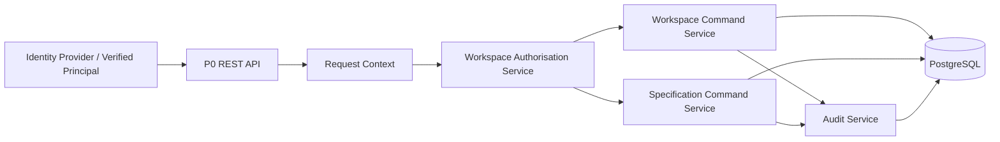

# SPEC-PLATFORM-002 — Project Workspace Boundary

| Field | Value |
|---|---|
| **Status** | **APPROVED** — approved by the Project Sponsor on 2026-08-24T16:52:46Z |
| **Specification version** | `1.0.0` |
| **Parent specification** | `SPEC-PLATFORM-001 — Canonical Specification Core` |
| **Priority** | P0 / Critical |
| **Owning bounded context** | Workspace Management |
| **Primary outcome** | Every specification, revision, approval, validation finding, audit event and evidence record is owned by exactly one project and accessible only to an authorised project member. |
| **Approval record** | `APPROVAL-WORKSPACE-001`; Project Sponsor instruction; 2026-08-24T16:52:46Z |

---

## 1. Intent and decision

This specification establishes the security and ownership boundary for the P0 Canonical Specification Core. It defines what a project is, how a principal becomes a project member, what Owners, Editors and Viewers may do, and how every P0 read or mutation is isolated to the correct project.

> **Decision:** P0 uses a deliberately small, explicit role model—**Owner**, **Editor**, and **Viewer**—implemented by a server-side authorisation service. Project scope is derived from the requested resource and verified membership; it is never trusted from a client-supplied role or tenant claim.

This child specification implements the project-boundary and least-privilege portions of `SPEC-PLATFORM-001`. It is prerequisite work for any persistent specification, approval, validation or audit endpoint.

### 1.1 Scope

| Capability | Required P0 behaviour |
|---|---|
| **Project ownership** | Every P0 engineering artefact belongs to one immutable project ID. A resource cannot be reassigned to another project after creation. |
| **Membership** | An Owner can add, change and revoke active membership for an identified principal. |
| **Roles** | Owner, Editor and Viewer roles are evaluated server-side for every P0 command and query. |
| **Resource authorisation** | A request is permitted only when the authenticated principal holds the capability required for the action in the resource’s project. |
| **Ownership continuity** | A project always retains at least one active Owner. Ownership transfer is atomic, auditable and never leaves a project ownerless. |
| **Auditability** | Membership and authorisation decisions emit structured, append-only audit events. |
| **Data isolation** | Repository reads are scoped by authorised project ID, preventing cross-project enumeration, read or mutation. |

### 1.2 Out of scope

P0 excludes organisation hierarchy, business-unit policy inheritance, groups, SCIM, enterprise SSO, just-in-time provisioning, ABAC, external guest invitation flows, service-account management, custom roles and cross-project resource sharing. P0 does not replace the platform identity provider; it consumes a verified principal identity and manages only AGASTYA project authorisation.

---

## 2. Domain model and authorisation policy

### 2.1 Aggregates and invariants

```text
Tenant (identity context; not mutable through P0 Workspace API)
  └── Project
        ├── ProjectMembership [principal, role, status]
        └── Project-scoped engineering artefacts
              ├── Specification family and revisions
              ├── Validation runs and findings
              ├── Approvals
              ├── Evidence
              └── Audit events
```

| Aggregate / entity | Responsibility | Non-negotiable invariant |
|---|---|---|
| **Project** | Owns its stable project identifier, display information and active membership set. | Belongs to exactly one tenant; never derives tenant ownership from client input. |
| **ProjectMembership** | Represents one principal’s active or revoked role grant within a project. | At most one active membership per `(project_id, principal_id)`. |
| **AuthorisationDecision** | Records the evaluated capability, scope, decision and rationale for a request. | Decision is server-side and traceable to principal, resource project and policy version. |
| **Project-scoped artefact** | Any P0 domain object stored under a project. | May only be created, queried or mutated under a successfully authorised project scope. |

| Invariant ID | Rule |
|---|---|
| **INV-WS-001** | A project must have at least one active Owner at all times. |
| **INV-WS-002** | A principal has no more than one active membership per project. A role change updates the active membership under optimistic concurrency; it does not create duplicate active grants. |
| **INV-WS-003** | Only an active Owner may manage membership, transfer ownership, approve a specification or archive a project-scoped specification. |
| **INV-WS-004** | A Viewer may read authorised project resources but may not create, change, validate, approve, archive or alter membership. |
| **INV-WS-005** | An Editor may create, revise and validate specifications but may not approve, archive or manage membership. |
| **INV-WS-006** | Every authorisation decision and membership mutation is audit-recorded. A denial produces no domain mutation. |
| **INV-WS-007** | Project and tenant identifiers used by persistence queries originate from server-side resource resolution and verified identity context. |

### 2.2 Role-capability matrix

| Capability | Owner | Editor | Viewer |
|---|:---:|:---:|:---:|
| Read project, specification, revision, diff and audit history | Yes | Yes | Yes |
| Create draft specification | Yes | Yes | No |
| Create copy-on-write revision | Yes | Yes | No |
| Request or view validation | Yes | Yes | Read only |
| Approve, reject or request changes to a specification | Yes | No | No |
| Archive a specification | Yes | No | No |
| Add, change or revoke membership | Yes | No | No |
| Transfer ownership | Yes | No | No |
| View denied-action audit records in own project | Yes | Yes | Yes, subject to audit read policy |

### 2.3 Resolved ownership-transfer policy

The earlier open question—whether a sole Owner can transfer ownership—has been resolved as follows:

> An active Owner may transfer ownership only to an existing active **Editor** in the same project. The service atomically promotes the target to Owner and demotes the initiating Owner to Editor. The command requires the current membership version of both principals, cannot target the initiator, cannot execute across projects, and records one correlated audit event. It therefore never leaves the project without an active Owner.

This P0 rule avoids an invitation/acceptance workflow and is safe because the target must already be an authenticated active member. A later enterprise specification may introduce pending transfer acceptance, multiple scoped owner roles or organisational recovery processes.

---

## 3. Functional requirements

| ID | Requirement | Priority | Acceptance criteria |
|---|---|---|---|
| **FREQ-WORKSPACE-001** | The system shall allow an Owner to add a verified principal as an Owner, Editor or Viewer in their project. | MUST | `AC-WORKSPACE-001`, `AC-WORKSPACE-002` |
| **FREQ-WORKSPACE-002** | The system shall evaluate server-side role capability and project membership on every P0 project-scoped request before executing a query or command. | MUST | `AC-WORKSPACE-003`, `AC-WORKSPACE-004` |
| **FREQ-WORKSPACE-003** | The system shall allow an Owner to change or revoke an active membership only when the action preserves at least one active Owner. | MUST | `AC-WORKSPACE-005` |
| **FREQ-WORKSPACE-004** | The system shall provide an atomic ownership-transfer command that promotes an active Editor and demotes the initiating Owner. | MUST | `AC-WORKSPACE-006` |
| **FREQ-WORKSPACE-005** | The system shall audit each membership mutation and every denied project-scoped command without storing secrets or unredacted restricted payloads. | MUST | `AC-WORKSPACE-007` |
| **FREQ-WORKSPACE-006** | The system shall list memberships only to an authorised project member and shall never expose membership information from another project. | SHOULD | `AC-WORKSPACE-008` |

### 3.1 Business rules

| ID | Rule | Enforcement |
|---|---|---|
| **RULE-WORKSPACE-001** | A Viewer may never create, alter, validate, approve or archive a specification revision. | Server-side capability policy. |
| **RULE-WORKSPACE-002** | An Editor may never approve, archive or manage membership. | Server-side capability policy. |
| **RULE-WORKSPACE-003** | A membership mutation or role change that would remove or demote the final active Owner must be rejected with `LAST_OWNER_PROTECTED`. | Transactional domain rule. |
| **RULE-WORKSPACE-004** | Ownership transfer requires an Owner initiator and an active Editor target in the same project; it is performed atomically with optimistic concurrency checks. | Transactional domain rule. |
| **RULE-WORKSPACE-005** | A P0 artefact cannot be created under a project ID that does not match the authorisation scope resolved by the service. | API and persistence query policy. |

---

## 4. Architecture and persistence design

### 4.1 Components



| Component | Required responsibilities |
|---|---|
| **Request Context** | Carry verified `principal_id`, tenant context, correlation ID and request metadata. It does not accept role/tenant authority from mutable client payload fields. |
| **Workspace Authorisation Service** | Resolve target project from the path/resource, load active membership, map role to capability, return an allow/deny decision and reason code. |
| **Workspace Command Service** | Manage memberships and atomic ownership transfer; enforce ownership-continuity invariants. |
| **Specification Command Service** | Ask the authorisation service before all specification commands and use the authorised project scope in persistence queries. |
| **Audit Service** | Append correlated events for membership changes, authorisation denials and successful privileged actions. |

### 4.2 Data model

| Table | Required fields | Constraints and indexes |
|---|---|---|
| `projects` | `id`, `tenant_id`, `name`, `created_at`, `created_by` | Unique `(tenant_id, normalized_name)`; index `(tenant_id, id)`. |
| `project_memberships` | `id`, `project_id`, `principal_id`, `role`, `status`, `version`, `created_at`, `created_by`, `revoked_at`, `revoked_by` | Partial unique index for active `(project_id, principal_id)`; FK to project; role enumeration. |
| `authorisation_decisions` | `id`, `request_id`, `principal_id`, `project_id`, `capability`, `outcome`, `reason_code`, `occurred_at` | Retention handled with audit policy; no sensitive request body. |
| `audit_events` | `id`, `request_id`, `project_id`, `actor_id`, `action`, `target_type`, `target_id`, `outcome`, `metadata_jsonb`, `occurred_at` | Append-only database grant; index `(project_id, occurred_at DESC)`. |

The `project_id` must be carried by all P0 specification-domain tables and used in every query predicate, even where a resource identifier is globally unique. This is both a defence-in-depth measure and a performance aid for project-scoped access patterns.

### 4.3 API contract

| Method and route | Required caller | Behaviour |
|---|---|---|
| `POST /v1/projects` | Authenticated platform bootstrap principal | Creates a project and first Owner membership atomically. |
| `GET /v1/projects/{projectId}/memberships` | Any project member | Lists active memberships for the authorised project. |
| `POST /v1/projects/{projectId}/memberships` | Owner | Adds a verified principal as Owner, Editor or Viewer. |
| `PATCH /v1/projects/{projectId}/memberships/{membershipId}` | Owner | Changes a role using membership-version concurrency control; protects last Owner. |
| `DELETE /v1/projects/{projectId}/memberships/{membershipId}` | Owner | Revokes membership using membership-version concurrency control; protects last Owner. |
| `POST /v1/projects/{projectId}/ownership-transfers` | Owner | Atomically transfers ownership to an active Editor. |
| `GET /v1/projects/{projectId}/authorisation-context` | Any project member | Returns the caller’s effective P0 capabilities only; never exposes another user’s access token or hidden policy data. |

### 4.4 Ownership-transfer request

```json
{
  "target_membership_id": "MEMBERSHIP-EDITOR-123",
  "initiator_membership_version": 4,
  "target_membership_version": 2,
  "reason": "Operational handover to the incoming project owner.",
  "idempotency_key": "b4d2d7b1-..."
}
```

A successful response returns both updated membership records, their new versions, the project ID, audit correlation ID and an `OWNERSHIP_TRANSFERRED` outcome. A conflict returns `409` when a membership version changed; a policy violation returns `422 LAST_OWNER_PROTECTED` or `422 INVALID_OWNERSHIP_TRANSFER_TARGET`.

---

## 5. Acceptance and verification plan

| ID | Given | When | Then | Test level |
|---|---|---|---|---|
| **AC-WORKSPACE-001** | An active Owner and a verified principal who is not a project member. | The Owner creates an Editor membership. | A single active Editor membership exists and a `MEMBERSHIP_GRANTED` audit event is recorded. | Integration |
| **AC-WORKSPACE-002** | An Editor in a project. | The Editor attempts to add or change a membership. | The service returns `403 CAPABILITY_DENIED`; no state changes occur; denial is audited. | Security / API |
| **AC-WORKSPACE-003** | A Viewer with an otherwise valid specification identifier. | The Viewer requests draft creation, validation, revision or approval. | Each write is denied before any specification command runs. | Security / Integration |
| **AC-WORKSPACE-004** | A member of Project A and a resource belonging to Project B. | The member reads or mutates the Project B resource. | The service denies access without revealing whether the resource exists. | Security / Integration |
| **AC-WORKSPACE-005** | A project with exactly one active Owner. | That Owner attempts to revoke or demote their own membership. | The command fails with `LAST_OWNER_PROTECTED`; membership state remains unchanged. | Domain / Integration |
| **AC-WORKSPACE-006** | An Owner and an active Editor in the same project. | The Owner submits a current-version ownership transfer. | Target becomes Owner, initiator becomes Editor, both changes are atomic and audited. | Integration / Concurrency |
| **AC-WORKSPACE-007** | An authorised or denied membership mutation. | The request completes. | An append-only audit event contains project, actor, action, target, outcome, request ID and timestamp but no secret data. | Integration |
| **AC-WORKSPACE-008** | A Viewer in Project A and memberships in Projects A and B. | The Viewer lists Project A memberships. | Only Project A memberships are returned. | API / Security |

### 5.1 Security test matrix

| Principal state | Read own project | Create/revise | Validate | Approve | Manage members | Cross-project access |
|---|---:|---:|---:|---:|---:|---:|
| Owner | Allow | Allow | Allow | Allow | Allow | Deny |
| Editor | Allow | Allow | Allow | Deny | Deny | Deny |
| Viewer | Allow | Deny | Read-only | Deny | Deny | Deny |
| Non-member | Deny | Deny | Deny | Deny | Deny | Deny |
| Unauthenticated | Deny | Deny | Deny | Deny | Deny | Deny |

### 5.2 Exit gate

`SPEC-PLATFORM-002` is ready for approval only if all functional requirements have implementation-ready acceptance criteria, no open questions remain, the ownership-transfer policy is accepted, the API contract is approved, and the role/isolation test matrix is defined. It is ready for **implementation completion** only after every acceptance scenario has passing evidence, no cross-project test can read or mutate another project’s data, and the last-Owner invariant survives concurrent mutation attempts.

---

## 6. Implementation dependencies

| Dependency | Relationship |
|---|---|
| `SPEC-PLATFORM-001` | Parent specification; provides canonical lifecycle, audit and authoritative-revision requirements. |
| `ADR-PLATFORM-001` | Must define the relational transaction and database-permission strategy supporting immutable audit/revision records. |
| `API-CONTRACT-WORKSPACE-V1` | Child OpenAPI contract to be approved before implementation of Workspace REST endpoints. |
| `TEST-SPEC-WORKSPACE-001` | Child test specification defining fixtures, role matrix, concurrency cases and security regression evidence. |

---

## 7. Approval record and implementation authorisation

The Project Sponsor approved `SPEC-PLATFORM-002` version `1.0.0` on **2026-08-24T16:52:46Z**. This approval confirms the fixed Owner / Editor / Viewer role model and atomic sole-Owner transfer policy. It authorises implementation of P0-B after the P0-A foundation dependencies and relevant P0 data-model ADRs are complete.

---

## References

[1] [SPEC-PLATFORM-001 — Canonical Specification Core](file:///Users/mohankrishnagundala/Documents/Agastya/specifications/SPEC-PLATFORM-001.md)
[2] [AGASTYA README — local master product specification](file:///Users/mohankrishnagundala/Documents/Agastya/README.md)
