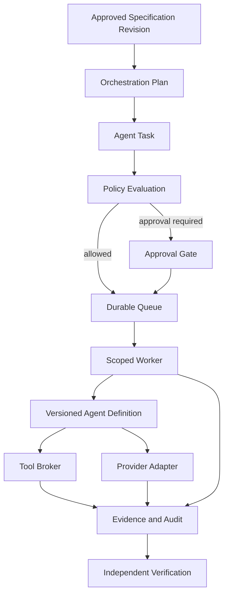
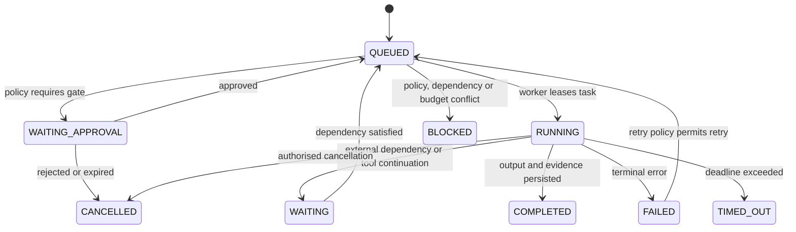

# SPEC-PLATFORM-003 — Multi-Agent Orchestration Layer

| Field | Value |
|---|---|
| **Status** | **APPROVED** — approved by the Project Sponsor on 2026-08-24T16:57:28Z |
| **Specification version** | `0.1.0` |
| **Priority** | Strategic P2 capability; implementation follows P0 core, graph, verification, SRS, drift and impact foundations |
| **Owning bounded context** | Agent Control Plane |
| **Primary outcome** | Coordinate specialised AI agents through governed, evidence-producing, provider-neutral tasks rather than unbounded autonomous execution. |
| **Approval record** | `APPROVAL-AGENT-001`; Project Sponsor instruction; 2026-08-24T16:57:28Z |
| **Parent dependencies** | `SPEC-PLATFORM-001`, `SPEC-PLATFORM-002`, future verified Specification Graph, Risk and Impact capabilities |

---

## 1. Intent and product boundary

AGASTYA is not the coding agent. It is the **control plane** that selects, constrains, observes and evaluates specialised agents acting against an approved engineering specification. The Multi-Agent Orchestration Layer must create a reliable path from an approved task plan to controlled task execution, evidence, approval and verification.

> **Design objective:** An agent must never receive broader data access, tool permission, autonomy, budget or production authority than the exact project, specification, policy, risk classification and approved task require.

The layer coordinates narrow agents—such as Analyse, Specification, Validation, Architecture, Development, Test, Security, Verification, Drift, Impact, Launch, Curation and Governance agents—through a durable task model. It is provider-neutral: core domain rules must not depend on a particular LLM vendor, coding assistant, agent protocol or tool transport. [1]

### 1.1 In scope

| Capability | Required behaviour |
|---|---|
| **Agent Registry** | Register versioned agent definitions with capability, input/output contracts, provider adapter, permitted tools, risk profile, timeout, retry, cost and approval policy. |
| **Orchestration plan** | Convert an approved specification change into a reviewable directed acyclic graph (DAG) of narrowly scoped tasks. |
| **Durable task execution** | Persist task state before dispatch, run work asynchronously, survive worker/provider failure, and expose real-time status without blocking the UI. |
| **Policy and autonomy** | Evaluate project, environment, task, model, tool, budget and approval policies before every dispatch and sensitive action. |
| **Tool governance** | Broker agent tool requests through typed contracts, least privilege, audit and approval checks. |
| **Human approval** | Pause at policy-defined gates and resume only from an explicit, versioned approval decision. |
| **Evidence and explainability** | Attach concise rationale, inputs/outputs, policy decisions, tool results, model/provider metadata and verification evidence to each task. |
| **Provider abstraction** | Support interchangeable adapters without embedding provider-specific task logic in specifications or orchestration rules. |
| **Cost and reliability controls** | Track model use, tokens, latency, quality signals, retry/fallback outcome and budgets. |

### 1.2 Out of scope

This draft does not authorise unrestricted agent access to production, self-modifying policies, autonomous product release, hidden chain-of-thought storage, an agent marketplace, every provider integration, a universal multi-agent reasoning framework, or autonomous Level 4 operation. It does not replace AGASTYA’s future Verification Engine; agents produce outputs and evidence, while independent verification decides conformance.

---

## 2. Governing principles and autonomy model

### 2.1 Mandatory invariants

| ID | Invariant |
|---|---|
| **INV-AGENT-001** | Every agent task references a tenant, project, specification version, requested outcome, risk level and immutable task input. |
| **INV-AGENT-002** | A task cannot dispatch until agent eligibility, input schema, model/provider, permission profile, policy, budget and approval requirements are evaluated. |
| **INV-AGENT-003** | An agent may use only brokered tools explicitly present in its effective permission grant; direct secret or production access is prohibited. |
| **INV-AGENT-004** | Task state transitions are durable, ordered and idempotent. A worker crash or provider timeout cannot silently lose a task or create an unrecorded duplicate action. |
| **INV-AGENT-005** | High-risk actions pause for human approval before the sensitive action, not merely after an agent has produced an irreversible result. |
| **INV-AGENT-006** | Agent-produced proposals are non-authoritative until the governing specification, policy and independent verification accept them. |
| **INV-AGENT-007** | Every significant agent decision exposes concise rationale, evidence, assumptions, alternatives, risks and confidence; private chain-of-thought is never persisted or exposed. |
| **INV-AGENT-008** | Provider/model outage or unsuitable response must yield a visible task state and evidence record; it must not be represented as a verified result. |

### 2.2 Configurable autonomy levels

| Level | Behaviour | P0/P2 default policy |
|---|---|---|
| **0 — Assist** | Agent proposes; human executes all changes. | Permitted for all agent types. |
| **1 — Supervised** | Agent executes explicitly low-risk, reversible tasks; human approves consequential output. | Default for early orchestration pilots. |
| **2 — Controlled autonomy** | Agent executes predefined workflows within scoped policies, budgets and verification requirements. | Permitted only after policy, tool broker and verification gates exist. |
| **3 — High autonomy** | Agent executes complex workflows inside strict project/environment boundaries. | Deferred until mature graph, risk, evidence and operational controls exist. |
| **4 — Autonomous** | Agent acts with exceptional independence. | Explicitly excluded from this specification and not a default option. |

An autonomy level is a maximum permitted ceiling, not an entitlement. Effective autonomy is the minimum allowed by the organisation, project, environment, agent, task risk, selected tools and current approval state.

---

## 3. Domain model



| Entity | Responsibility | Required key fields |
|---|---|---|
| **AgentDefinition** | Versioned registry record describing a narrow agent capability. | `id`, `version`, `provider_adapter`, capabilities, input/output schemas, tools, permission profile, risk level, timeout, retry, cost and approval policies. |
| **ProviderAdapter** | Translate a provider-neutral task invocation into a model/provider request and normalise streamed events and outcomes. | Adapter version, supported models, privacy/data boundary, tool-call support, health and fallback eligibility. |
| **OrchestrationPlan** | Versioned DAG of task nodes, dependencies, expected outputs, gates, parallelism constraints and success criteria. | Project, specification version, plan version, risk, policy snapshot, task nodes and dependency edges. |
| **AgentTask** | Immutable execution request and mutable durable state record for one agent operation. | Task ID, plan ID, tenant, project, specification version, agent/model selection, input hash, expected output, permissions, budget, state, evidence. |
| **PolicyDecision** | Reproducible allow, deny, limit or approval-required result for a task or tool action. | Policy version, evaluated facts, decision, reason codes, effective grants and timestamp. |
| **ToolInvocation** | Brokered, typed and auditable request for a tool action. | Tool ID/version, input hash, effective permission, risk, approval, result reference and execution state. |
| **ApprovalGate** | Human decision on a versioned proposed action. | Gate ID, policy, action summary, risk, specification version, approver, decision and evidence. |
| **ExecutionEvidence** | Immutable record of task output, provider/model metadata, status, quality/verification result, tool results and concise rationale. | Subject task, expected/observed outcome, provenance, timestamps and artefact URIs. |

### 3.1 Task lifecycle



Every transition includes the prior state, next state, actor/worker, timestamp, causal event, attempt number and correlation ID. A lease-based worker mechanism prevents two workers from executing the same task simultaneously. Tool actions use separate idempotency keys because a retry of a task must not repeat a non-idempotent external action.

---

## 4. Functional requirements

| ID | Requirement | Priority |
|---|---|---|
| **FREQ-AGENT-001** | The system shall register and version AgentDefinitions with declared capabilities, supported task types, input/output contracts, permitted tools, permission profile, risk, timeout, retry, cost and approval policies. | MUST |
| **FREQ-AGENT-002** | The system shall create an OrchestrationPlan only from an approved specification revision and persist the specification, policy and input versions used to create it. | MUST |
| **FREQ-AGENT-003** | The system shall validate each task’s input against its AgentDefinition contract and evaluate eligibility, policy, budget, autonomy and approval requirements before dispatch. | MUST |
| **FREQ-AGENT-004** | The system shall execute tasks asynchronously through a durable queue and scoped workers, stream observable status, and support timeout, retry, cancellation, dead-letter and compensation policies. | MUST |
| **FREQ-AGENT-005** | The system shall broker all agent tool calls through registered tool contracts and effective permission grants. | MUST |
| **FREQ-AGENT-006** | The system shall pause tasks at approval gates required by risk, policy, tool permission, environment or cost before dispatching the sensitive action. | MUST |
| **FREQ-AGENT-007** | The system shall store provider/model/version, prompt/template version, task input/output hashes, tool results, concise rationale, cost, latency, state and evidence for each task. | MUST |
| **FREQ-AGENT-008** | The system shall support provider/model routing and approved fallback without exposing provider-specific behaviour to orchestration business logic. | SHOULD |
| **FREQ-AGENT-009** | The system shall enforce per-project concurrency, token/cost budget and rate-limit policies and place violating tasks in BLOCKED or WAITING_APPROVAL state. | MUST |
| **FREQ-AGENT-010** | The system shall emit a verified task output only when an independently configured verification requirement has completed; otherwise it shall state proposal, partial, blocked or failed truth status. | MUST |

### 4.1 Agent Registry contract

| Registry field | Requirement |
|---|---|
| **Identity** | Stable agent ID, name, version, status and owner. |
| **Scope** | Supported task types, capability declarations and compatible specification types. |
| **Contracts** | Input JSON Schema, output JSON Schema, required context, expected evidence and failure modes. |
| **Permissions** | Allowed tools, data classifications, environments, repository scopes and operation types. |
| **Control policy** | Risk level, maximum autonomy, timeout, retry, concurrency, cost ceiling and approval rules. |
| **Provider metadata** | Adapter ID/version, approved models, privacy class and fallback set. |
| **Observability** | Required events, output quality metrics and evaluation/verification requirements. |

### 4.2 Tool broker contract

Every tool registration must provide a unique ID/version, purpose, input/output schema, permission class, data-access classification, risk, timeout, retry policy, reversibility, audit requirement and approval policy. Before invocation, the broker evaluates:

```text
Is this tool registered and enabled?
Is the agent allowed to call it for this task?
Does the effective task grant allow this operation and data scope?
Is the action reversible and within policy risk tolerance?
Does it require human approval or a separate confirmation gate?
Does its input conform to the registered schema?
```

A tool invocation must be rejected before execution if any answer fails. The broker stores an input hash, redacted summary, effective permission decision, output reference, error outcome and evidence link. It must never grant a raw long-lived credential to a model.

---

## 5. Orchestration, policy and runtime architecture

### 5.1 Plan compilation

An OrchestrationPlan is compiled from an approved specification, its impact/risk analysis and an approved workflow template. It may support parallel independent tasks, but an agent task cannot begin until every declared dependency and required approval is satisfied.

| Plan phase | Example agent | Required preconditions | Result |
|---|---|---|---|
| Analyse | Analyse Agent | Approved specification or approved brownfield-analysis request. | Problem/risk/unknowns proposal. |
| Specify / Validate | Specification and Validation Agents | Human intent, selected constraints and input contracts. | Proposed or validated structured specification content. |
| Design | Architecture and Contract Agents | Approved requirements and impact analysis. | ADR, architecture or contract proposal. |
| Develop | Development Agent | Approved implementation task, repository scope, tool grant and required approval. | Proposed patch/pull request plus evidence. |
| Verify | Test, Security and Verification Agents | Implementation revision, expected test/verification criteria. | Test evidence and conformance verdict. |
| Curate | Drift and Curation Agents | Runtime or incident evidence. | Governed recommendation; never an automatic authoritative rewrite. |

### 5.2 Policy evaluation order

```text
1. Resolve tenant, project, environment and exact specification revision.
2. Resolve effective project policy and organisation policy snapshot.
3. Validate agent status, version, task type, input contract and required context.
4. Calculate task risk and effective autonomy ceiling.
5. Resolve permitted provider/model, cost/concurrency limit and data classification.
6. Resolve required tools and least-privilege grants.
7. Determine approval gate requirements.
8. Allow, deny, block or queue the task with a recorded PolicyDecision.
```

An agent task holds the policy snapshot that governed its execution. Later policy changes govern future dispatches; they do not silently rewrite the reason a historic task was allowed. A policy change may, however, pause or cancel queued work before dispatch where the current policy requires it.

### 5.3 Durable execution requirements

The orchestration runtime requires a durable task store, queue, worker lease, event log and real-time event stream. It should use a job queue and worker model rather than perform model/provider calls on an HTTP request thread. The UI consumes bounded, redacted status events through a stream; it does not retain worker state.

| Failure mode | Required behaviour |
|---|---|
| Worker dies while leased task runs | Lease expires; task is recovered according to idempotency and retry policy; prior attempt evidence remains. |
| Provider timeout or outage | Record failed/timeout attempt; retry only under approved policy or use an approved fallback adapter. |
| Tool invocation timeout | Persist tool attempt and result state; invoke compensation only when a registered safe compensation exists. |
| Duplicate delivery | Task and tool idempotency keys prevent duplicate committed state or repeated destructive action. |
| Budget or quota exceeded | Transition to `BLOCKED` or `WAITING_APPROVAL` with a policy decision, not silent degradation. |
| Approval rejected or expired | Transition to `CANCELLED` and preserve proposal/evidence. |

### 5.4 Provider and model abstraction

The provider adapter boundary accepts a provider-neutral invocation envelope and returns normalised events. It includes no provider-specific policy conditions in the core task lifecycle.

```json
{
  "task_id": "TASK-...",
  "agent_definition": {"id": "AGENT-DEVELOPMENT", "version": "1.0.0"},
  "specification": {"id": "SPEC-...", "version": "1.2.0", "content_hash": "sha256:..."},
  "input": {"artifact_uri": "...", "input_hash": "sha256:..."},
  "effective_grant": {"tools": ["TOOL-REPOSITORY-READ"], "environment": "STAGING"},
  "limits": {"timeout_seconds": 900, "max_cost": "project policy reference"},
  "output_contract": "schema reference"
}
```

Each adapter must declare data residency/privacy limits, supported tool calling, streaming support, model catalogue and fallback eligibility. An adapter cannot be selected for a task if its privacy boundary, available capability or contract support violates policy.

---

## 6. Security, data and evidence controls

| Control | Requirement |
|---|---|
| **Agent identity** | Agent definitions, provider adapters and workers have separate identities and scoped service permissions. |
| **Secret handling** | Agents never receive raw credentials. The tool broker resolves short-lived, scoped credentials only at execution boundary. |
| **Data minimisation** | Provide only the context, files, snippets and evidence needed for the task, subject to classification policy. |
| **Repository scope** | Repository access is task-specific, branch/revision-scoped and read-only unless an approved write task explicitly grants a bounded write operation. |
| **Environment isolation** | Development, test, staging and production have separate grants. Production tools are denied by default and require explicit policy/approval. |
| **Prompt-injection defence** | Retrieved text, repository content, tickets and tool outputs are untrusted data; they cannot alter the governing task policy or tool permissions. |
| **Provenance** | Record model/provider/version, agent definition, prompt/template version, context source references, policy decision, tools and evidence. |
| **Explainability** | Store concise rationale and evidence, never private hidden reasoning. |
| **Human oversight** | High-risk, irreversible, production, database-migration, security-policy and destructive actions require an approval gate. |

---

## 7. Acceptance and verification plan

| ID | Given | When | Then | Verification type |
|---|---|---|---|---|
| **AC-AGENT-001** | A registered Development Agent with an input schema and allowed repository-read tool. | A valid low-risk analysis task is submitted. | The task is queued with immutable inputs, policy snapshot and effective least-privilege grant. | Integration |
| **AC-AGENT-002** | A task asks for a tool outside its AgentDefinition permission profile. | The agent attempts the tool invocation. | The broker denies before execution and records the decision/evidence. | Security |
| **AC-AGENT-003** | A task requires a protected branch write or production operation. | The plan reaches the sensitive action. | The task enters `WAITING_APPROVAL`; no action executes before an authorised decision. | Integration |
| **AC-AGENT-004** | A leased task loses its worker before completion. | The lease expires. | Task recovery follows retry/idempotency policy, retains prior attempt evidence and does not duplicate a tool action. | Resilience |
| **AC-AGENT-005** | A selected provider times out and an approved fallback exists. | The task exceeds timeout. | The failed attempt is recorded; fallback executes only under recorded policy and task state is visible. | Integration |
| **AC-AGENT-006** | A non-member or wrong-project caller accesses task state. | The caller queries or cancels a task. | Access is denied without disclosing cross-project task information. | Security |
| **AC-AGENT-007** | A completed agent proposes a code change but verification is pending. | A user inspects task result. | Output truth state is proposal/unverified, not verified; required next verification is shown. | End-to-end |
| **AC-AGENT-008** | A project has consumed its approved task/model budget. | A new task is submitted. | The task is blocked or routed for approval with cost evidence and no provider request occurs. | Integration |

### 7.1 Draft implementation exit gate

This specification is implementation-ready only when the following child contracts are approved: AgentDefinition JSON Schema, Task/Plan API contract, Tool Broker contract, policy language/evaluator specification, approval-gate contract, event-stream contract, provider-adapter contract, and threat model. A first implementation should begin with two narrow, read-only agents—such as Analyse and Validation—at Autonomy Level 0 or 1. Repository write, deployment, production and autonomous task types must remain disabled until their independent verification and policy controls are demonstrated.

---

## 8. Accepted design risks and required child specifications

| ID | Question / child specification | Current status and mandatory gate |
|---|---|---|
| **QUESTION-AGENT-001** | Which first provider adapter and model privacy profile will be approved for the pilot? | **ACCEPTED_RISK** — must be resolved before any external model invocation. |
| **QUESTION-AGENT-002** | What is the P2 queue/worker deployment target and operational SLO? | **ACCEPTED_RISK** — must be resolved through `ADR-AGENT-001` before runtime implementation. |
| **QUESTION-AGENT-003** | Which tools are safe for the first read-only agent cohort? | **ACCEPTED_RISK** — resolve through registered Repository Read, Specification Read and Test Result Read contracts before tools are enabled. |
| **SPEC-AGENT-001** | Agent Registry and AgentDefinition schema. | Required before registry implementation. |
| **SPEC-AGENT-002** | Durable Task and Orchestration Plan model. | Required before queue/worker implementation. |
| **SPEC-AGENT-003** | Tool Broker and permission-grant model. | Required before any tool-enabled agent executes. |
| **SPEC-AGENT-004** | Policy, risk and approval-gate evaluator. | Required before controlled autonomy. |
| **SPEC-AGENT-005** | Provider Adapter contract and pilot adapter. | Required before external model execution. |
| **ADR-AGENT-001** | Durable orchestration runtime and queue selection. | Must compare managed background execution options, retry semantics, security and operational cost before implementation. |

---

## 9. Approval record and implementation authorisation

The Project Sponsor approved `SPEC-PLATFORM-003` version `0.1.0` on **2026-08-24T16:57:28Z**. This approval authorises design and implementation planning for a controlled, read-only Level 0/1 pilot only. It does not authorise production access, autonomous code changes, deployment, background scheduling configuration or any external provider credential. The required child contracts, threat model, runtime decision and provider/privacy review remain mandatory gates before execution work begins.

---

## References

[1] [AGASTYA README — local master product specification](file:///Users/mohankrishnagundala/Documents/Agastya/README.md)
[2] [SPEC-PLATFORM-001 — Canonical Specification Core](file:///Users/mohankrishnagundala/Documents/Agastya/specifications/SPEC-PLATFORM-001.md)
[3] [SPEC-PLATFORM-002 — Project Workspace Boundary](file:///Users/mohankrishnagundala/Documents/Agastya/specifications/SPEC-PLATFORM-002.md)
