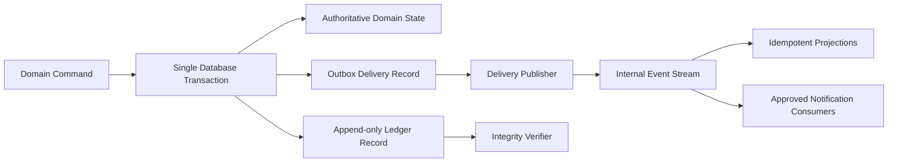

# SPEC-PLATFORM-004 — Event-Driven Audit & Evidence Ledger

| Field | Value |
|---|---|
| **Status** | **APPROVED** — approved by the Project Sponsor on 2026-08-24T17:03:32Z |
| **Specification version** | `0.1.0` |
| **Priority** | Foundational cross-cutting platform capability; P0 audit primitives first, full ledger implementation alongside P1/P2 evidence and agent control plane |
| **Owning bounded context** | Audit and Evidence |
| **Primary outcome** | Provide immutable, project-scoped, integrity-verifiable events and evidence records that reconstruct why an engineering decision or system state exists. |
| **Approval record** | `APPROVAL-LEDGER-001`; Project Sponsor instruction; 2026-08-24T17:03:32Z |
| **Dependencies** | `SPEC-PLATFORM-001`, `SPEC-PLATFORM-002`, `SPEC-PLATFORM-003`, future Verification, Drift and Production Evidence integrations |

---

## 1. Intent and boundary

AGASTYA must be able to reconstruct every meaningful engineering operation—from a specification change through agent task execution, verification, approval, deployment and production observation—without treating mutable logs or an AI narrative as evidence. The Event-Driven Audit & Evidence Ledger is the durable foundation for this reconstruction.

> **Design objective:** Every material event is append-only, project-scoped, schema-versioned, correlated to its cause and subject, integrity-verifiable, and linked to evidence without exposing secrets or private reasoning.

The ledger separates three concepts that are often conflated. An **audit event** says an action or decision occurred. An **evidence record** says an observed result supports or contradicts an expected condition. An **event delivery message** distributes a durable event to projections and downstream services but is not itself the authoritative record.

| Concept | Authoritative purpose | Example |
|---|---|---|
| **Audit event** | Reconstruct action, actor, target, policy and outcome. | `SPECIFICATION_APPROVED` by a Project Owner. |
| **Evidence record** | Capture expected versus observed behaviour and truth status. | Contract test failed against revision `1.2.0`. |
| **Delivery message** | Reliably notify an interested internal consumer. | A verification projection consumes `VERIFICATION_COMPLETED`. |

### 1.1 In scope

| Capability | Required behaviour |
|---|---|
| **Canonical event envelope** | Define a versioned event schema with event ID, type/version, occurrence/record times, tenant/project scope, actor, subject, correlation/causation, classification, payload reference and integrity fields. |
| **Append-only ledger** | Persist events and evidence records without application-level update/delete; corrections and retractions are new superseding events. |
| **Integrity verification** | Maintain ordered per-project ledger sequences and hash chaining; expose a verifier that reports gaps, tampering or hash mismatch. |
| **Evidence links** | Record immutable metadata and hashes for test results, policy decisions, approvals, artefacts, logs, metrics, traces, incidents and runtime observations. |
| **Transactional publishing** | Use an outbox pattern so domain mutation and authoritative event recording commit atomically; publish at-least-once delivery events to consumers. |
| **Idempotent consumption** | Require consumers/projections to de-duplicate by event ID and retain consumer checkpoint/provenance. |
| **Project-scoped queries** | Authorise every event/evidence read by project scope and provide subject, correlation, type and time-window query paths. |
| **Retention and redaction controls** | Capture classifications and redacted summaries; preserve integrity while correcting sensitive-data mistakes through controlled tombstone/redaction events. |

### 1.2 Out of scope

This specification does not require a public blockchain, global total ordering across tenants, arbitrary third-party webhooks, a general analytics warehouse, unrestricted event replay to external systems, direct mutation of historical records, storage of raw secrets, or private model chain-of-thought. It does not make an event alone proof that a requirement is satisfied; verification rules and evidence determine that conclusion.

---

## 2. Integrity, privacy and event architecture

### 2.1 Ledger invariants

| ID | Invariant |
|---|---|
| **INV-LEDGER-001** | Every ledger record contains immutable event ID, tenant/project scope, event type/version, occurred/recorded timestamps, producer, subject, correlation ID and integrity metadata. |
| **INV-LEDGER-002** | Application paths append records only. Correction, redaction, supersession or deletion requests create a new governed event that references the prior record. |
| **INV-LEDGER-003** | Each project ledger partition has a monotonic sequence number and previous-record hash; the record hash covers canonical envelope metadata and payload hash/reference. |
| **INV-LEDGER-004** | Every domain mutation requiring audit commits its domain state, audit record and outbox entry in one transaction or commits none of them. |
| **INV-LEDGER-005** | Event consumers treat delivery as at-least-once and de-duplicate by immutable event ID; projections must be rebuildable from authoritative ledger records. |
| **INV-LEDGER-006** | All event/evidence reads are project-scoped and classification-aware. Event payloads, logs and delivery messages never include raw secrets or private reasoning. |
| **INV-LEDGER-007** | An evidence record references the exact subject version, expected behaviour, observed behaviour, provenance and truth status; unsupported assertions are `UNVERIFIED`, not `VERIFIED`. |
| **INV-LEDGER-008** | Integrity-verification results are themselves recorded as evidence and distinguish verified chain, gap, mismatch, unavailable and incomplete history. |

### 2.2 Canonical event envelope

```json
{
  "event_id": "EVENT-...",
  "event_type": "SPECIFICATION_APPROVED",
  "event_version": "1.0.0",
  "occurred_at": "2026-08-24T16:57:28Z",
  "recorded_at": "2026-08-24T16:57:29Z",
  "scope": {"tenant_id": "...", "project_id": "..."},
  "producer": {"kind": "SERVICE", "id": "SPECIFICATION-COMMAND-SERVICE", "version": "..."},
  "actor": {"kind": "HUMAN", "id": "..."},
  "subject": {"kind": "SPECIFICATION", "id": "SPEC-...", "version": "1.0.0"},
  "correlation_id": "REQ-...",
  "causation_id": "EVENT-...",
  "classification": "INTERNAL",
  "payload": {"schema_uri": "...", "hash": "sha256:...", "artifact_uri": "...", "redacted_summary": "..."},
  "integrity": {"sequence": 184, "previous_hash": "sha256:...", "record_hash": "sha256:..."}
}
```

The authoritative envelope retains only the minimum data necessary for reconstruction. Large test reports, traces, logs, patch artefacts and other payloads are stored as separately access-controlled artefacts; the ledger retains their content hash, classification, storage reference, provenance and retention policy. This protects the ledger from uncontrolled payload growth and supports integrity verification without duplicating sensitive content.

### 2.3 Event taxonomy

| Family | Representative types |
|---|---|
| **Specification lifecycle** | `SPECIFICATION_CREATED`, `REVISION_CREATED`, `VALIDATION_COMPLETED`, `SPECIFICATION_APPROVED`, `SPECIFICATION_SUPERSEDED` |
| **Workspace and policy** | `MEMBERSHIP_GRANTED`, `CAPABILITY_DENIED`, `POLICY_EVALUATED`, `APPROVAL_REQUESTED`, `APPROVAL_DECIDED` |
| **Agent orchestration** | `ORCHESTRATION_PLAN_CREATED`, `AGENT_TASK_QUEUED`, `AGENT_TASK_STARTED`, `TOOL_INVOCATION_DENIED`, `AGENT_TASK_COMPLETED` |
| **Verification and quality** | `TEST_EXECUTED`, `CONTRACT_VALIDATED`, `SECURITY_SCAN_COMPLETED`, `VERIFICATION_COMPLETED`, `DRIFT_DETECTED` |
| **Delivery and runtime** | `DEPLOYMENT_EXECUTED`, `METRIC_OBSERVED`, `INCIDENT_RECORDED`, `CURATION_RECOMMENDED` |
| **Ledger control** | `LEDGER_INTEGRITY_VERIFIED`, `EVIDENCE_REDACTED`, `RETENTION_HOLD_APPLIED`, `PROJECTION_REBUILT` |

### 2.4 Transactional outbox and delivery



The outbox makes reliable delivery an extension of authoritative state rather than a best-effort side effect. The publisher may retry delivery, and consumers may receive a message more than once. Therefore consumers record processed event IDs and remain idempotent. Consumer failures never alter or erase the ledger record; they create delivery/consumer evidence and trigger controlled retry or dead-letter processing.

### 2.5 Integrity and correction model

Each project ledger partition is ordered by sequence. `record_hash = SHA-256(canonical_envelope_without_record_hash || payload_hash || previous_hash)`. A periodic verifier checks sequence continuity, previous-hash linkage and record-hash recomputation. P2 may add signed batch checkpoints and immutable external storage anchoring after key-management and retention decisions are approved; neither is assumed before the relevant ADR is accepted.

A data-quality or privacy correction is never an in-place update. The platform appends a `SUPERSEDES`, `REDACTS` or `TOMBSTONES` event whose payload explains the permitted correction, target event, approver, policy and retained integrity metadata. The original restricted payload may be removed from separately governed artefact storage only under retention/privacy policy; the ledger preserves the fact and authority of the redaction.

---

## 3. Functional requirements

| ID | Requirement | Priority |
|---|---|---|
| **FREQ-LEDGER-001** | The system shall append schema-valid, project-scoped audit events with canonical envelope, event-type version and producer/actor/subject/correlation provenance. | MUST |
| **FREQ-LEDGER-002** | The system shall append evidence records that identify expected and observed behaviour, exact specification/implementation version, truth status, provenance, artefact hash and classification. | MUST |
| **FREQ-LEDGER-003** | The system shall enforce append-only ledger writes, per-project sequence allocation and hash chaining in the same transaction as the governed domain operation. | MUST |
| **FREQ-LEDGER-004** | The system shall publish delivery events through a transactional outbox and support idempotent internal consumer processing, retries and dead-letter evidence. | MUST |
| **FREQ-LEDGER-005** | The system shall expose project-authorised queries by subject, event type, correlation/causation, time range and evidence/truth state. | MUST |
| **FREQ-LEDGER-006** | The system shall verify ledger continuity and hash integrity for a requested project/time range and produce a durable integrity-evidence result. | MUST |
| **FREQ-LEDGER-007** | The system shall support governed correction, supersession and redaction events without mutating original ledger records. | MUST |
| **FREQ-LEDGER-008** | The system shall enforce event payload schema, classification, size, redaction and retention policies before append or delivery. | MUST |
| **FREQ-LEDGER-009** | The system shall allow projections to rebuild from the ledger while preserving the projection version, source range and consumer provenance. | SHOULD |

---

## 4. Security and operational controls

| Control | Design requirement |
|---|---|
| **Append-only permissions** | Application database roles receive insert/select only for ledger records; update/delete requires a separate tightly controlled administrative process, never normal application code. |
| **Scope enforcement** | Event and evidence queries compose project ID and authorisation checks in the same server-side access path. |
| **Payload safety** | Validate event payload size/schema, strip/reject secrets, disallow private reasoning and retain redacted summary plus content hash for external artefacts. |
| **Classification** | `PUBLIC`, `INTERNAL`, `CONFIDENTIAL` and `RESTRICTED` drive API redaction, projection eligibility, retention and tool/agent access. |
| **Encryption** | Encrypt authoritative data and artefacts at rest; use approved transport security for all producers, publishers and consumers. |
| **Producer authentication** | Only registered internal services or approved ingestion adapters may append event types; producer identity/version is mandatory. |
| **Replay protection** | Idempotency key and event ID uniqueness protect append paths; consumer checkpoints protect projections. |
| **Operational resilience** | Outbox retries, consumer dead-letter queues, backoff, alerting and replay controls are observable and require no loss of authoritative records. |

---

## 5. Acceptance and verification plan

| ID | Given | When | Then | Verification type |
|---|---|---|---|---|
| **AC-LEDGER-001** | An authorised specification command changes domain state. | The transaction commits. | Domain state, immutable ledger record and outbox record commit together with one correlation ID. | Integration |
| **AC-LEDGER-002** | An event payload fails schema, classification or secret-redaction policy. | A producer attempts append. | Append is rejected before persistence and denial evidence is recorded safely. | Security |
| **AC-LEDGER-003** | A project ledger contains ordered events. | The integrity verifier runs for a range. | It reports valid continuity and stores a verification evidence record. | Integration |
| **AC-LEDGER-004** | A test report exists for an implementation/specification version. | Evidence is appended. | It includes expected/observed behaviour, subject versions, artefact hash, provenance and truth state. | Integration |
| **AC-LEDGER-005** | An internal consumer receives the same delivery event twice. | It processes the second delivery. | Projection state changes only once and the duplicate is recorded according to consumer policy. | Resilience |
| **AC-LEDGER-006** | A record is identified as containing restricted data requiring correction. | An authorised redaction action occurs. | A new redaction event references the original; the original ledger record remains intact and query redaction policy is enforced. | Security |
| **AC-LEDGER-007** | A non-member requests another project's ledger records. | The query executes. | Access is denied without cross-project event disclosure. | Security |
| **AC-LEDGER-008** | A consumer projection is lost or version changes. | Rebuild is requested from a verified range. | Rebuilt projection records its ledger range, consumer version and integrity result. | End-to-end |

---

## 6. Accepted design risks and child specifications

| ID | Question / child contract | Current status and mandatory gate |
|---|---|---|
| **QUESTION-LEDGER-001** | Which durable event-stream and outbox publisher implementation meets expected volume, ordering and operational SLOs? | **ACCEPTED_RISK** — resolve through `ADR-LEDGER-001` before implementation. |
| **QUESTION-LEDGER-002** | What retention, legal-hold and redaction policy applies to each evidence classification? | **ACCEPTED_RISK** — resolve through governance/privacy policy before production evidence retention. |
| **QUESTION-LEDGER-003** | Is external signed checkpoint/immutable storage anchoring required for the initial enterprise offering? | **ACCEPTED_RISK** — resolve through threat-model and compliance review before any such commitment. |
| **SPEC-LEDGER-001** | Canonical Event Envelope and Event Type Registry schema. | Required before producer implementation. |
| **SPEC-LEDGER-002** | Evidence Record and Artefact Reference schema. | Required before verification/agent evidence integration. |
| **SPEC-LEDGER-003** | Outbox, consumer checkpoint and projection-rebuild contract. | Required before internal delivery implementation. |
| **SPEC-LEDGER-004** | Integrity Verification and Redaction protocol. | Required before ledger integrity claims. |
| **ADR-LEDGER-001** | Append-only storage, hash-chain and checkpoint architecture. | Required before persistence implementation. |

---

## 7. Approval record and implementation authorisation

The Project Sponsor approved `SPEC-PLATFORM-004` version `0.1.0` on **2026-08-24T17:03:32Z**. This approval authorises the detailed design of the event envelope, evidence contract, transaction/outbox behaviour and integrity threat model. It does not authorise external event delivery, external data sharing or cryptographic checkpoint commitments until the dependent ADRs, classification policy and retention requirements are approved.

---

## References

[1] [AGASTYA README — local master product specification](file:///Users/mohankrishnagundala/Documents/Agastya/README.md)
[2] [SPEC-PLATFORM-001 — Canonical Specification Core](file:///Users/mohankrishnagundala/Documents/Agastya/specifications/SPEC-PLATFORM-001.md)
[3] [SPEC-PLATFORM-003 — Multi-Agent Orchestration Layer](file:///Users/mohankrishnagundala/Documents/Agastya/specifications/SPEC-PLATFORM-003.md)
