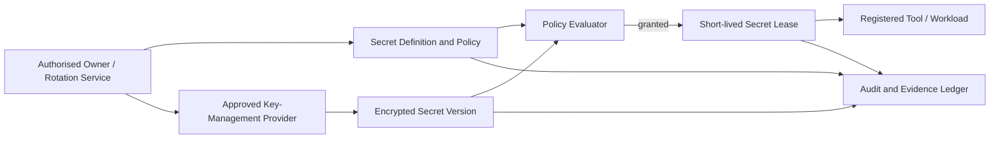
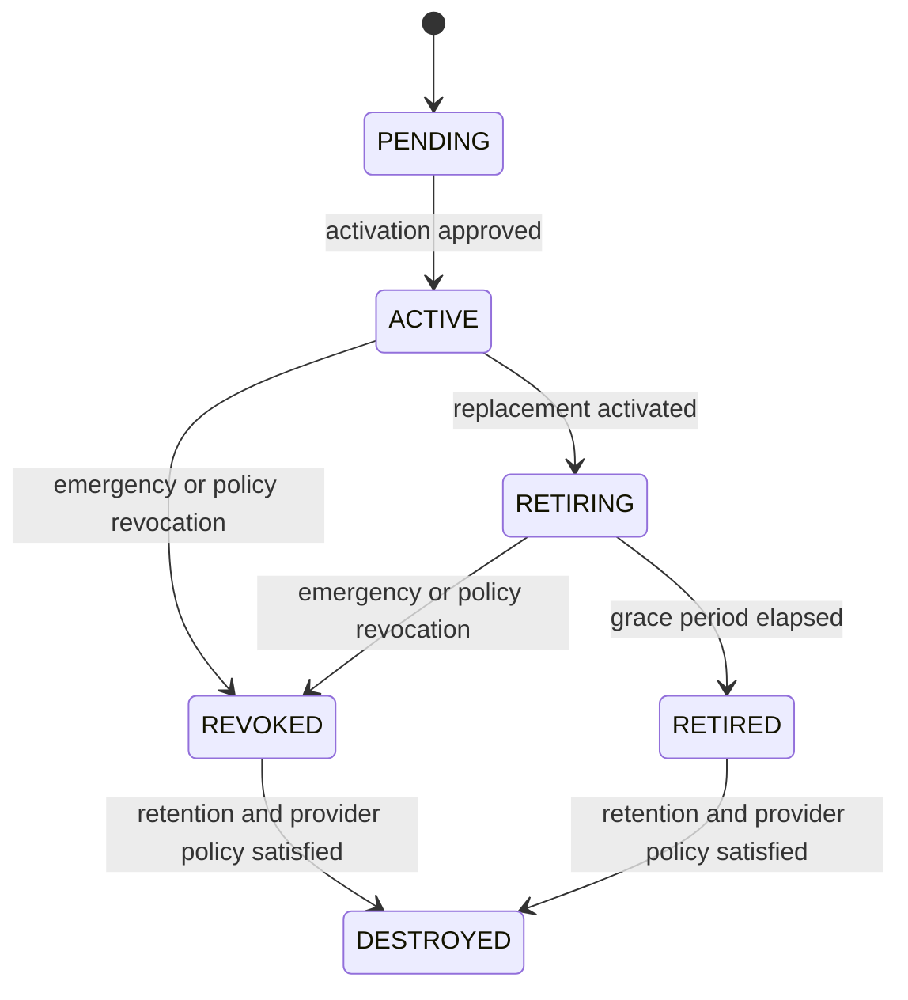

# SPEC-PLATFORM-005 — Secure Credential & Secret Vault Layer

| Field | Value |
|---|---|
| **Status** | **APPROVED** — approved by the Project Sponsor on 2026-08-24T17:25:11Z |
| **Specification version** | `0.1.0` |
| **Priority** | Foundational security capability for integrations, tools, agent execution and environment access |
| **Owning bounded context** | Secret and Credential Management |
| **Primary outcome** | Store and deliver credentials only through encrypted, scoped, short-lived and auditable grants—never through model context, UI responses, logs or durable agent task input. |
| **Approval record** | `APPROVAL-VAULT-001`; Project Sponsor instruction; 2026-08-24T17:25:11Z |
| **Dependencies** | `SPEC-PLATFORM-002`, `SPEC-PLATFORM-003`, `SPEC-PLATFORM-004`, identity provider and approved key-management service |

---

## 1. Intent and hard security boundary

The Secure Credential & Secret Vault Layer gives AGASTYA a central, governed way to manage integration credentials, API keys, OAuth client material, signing material, database credentials and tool-scoped tokens. It is designed to prevent a critical failure mode in AI-native engineering systems: treating credentials as ordinary configuration that can flow into prompts, logs, task state, code artefacts or user interfaces.

> **Hard boundary:** Secret plaintext may enter the vault through a protected write path and may be materialised only at a registered tool or workload execution boundary under a short-lived, scope-limited grant. It must never be returned by the normal API, rendered in the UI, embedded in agent prompts/context, persisted in audit payloads, or written to application logs.

The vault stores secret metadata separately from encrypted secret versions. The AGASTYA application performs no custom cryptography. Encryption/decryption and root-key operations are delegated to an approved key-management service or hardware-backed provider through an audited provider adapter.

### 1.1 In scope

| Capability | Required behaviour |
|---|---|
| **Secret identity and metadata** | Create project-scoped secret definitions with name, type, owner, classification, allowed environments, rotation policy and access policy; secret values are stored separately. |
| **Versioned encrypted values** | Write new immutable secret versions using envelope encryption and an approved key-management provider; activate, retire, revoke and destroy versions through governed lifecycle operations. |
| **Scoped secret leases** | Issue short-lived, non-exportable references or materialisation grants only to registered tools/workloads after identity, policy and task checks. |
| **Agent-safe tool injection** | A tool broker may materialise a secret directly into a tool execution environment without revealing plaintext to the agent/model or returning it in tool output. |
| **Policy and approvals** | Evaluate tenant, project, environment, principal/workload, tool, secret classification, purpose, risk and approval policy before every write, lease, rotation or revocation action. |
| **Rotation and revocation** | Track expiry/rotation windows, trigger governed rotation workflow, preserve version provenance and immediately block revoked versions. |
| **Audit and evidence** | Record metadata-only ledger events for lifecycle and access decisions, using fingerprints/version IDs but never plaintext or recoverable token data. |
| **Break-glass access** | Support separately governed emergency access with multi-party approval, short lease, enhanced audit and mandatory post-event review; exclude it from ordinary agent workflows. |

### 1.2 Out of scope

This specification does not authorise storing end-user passwords, raw personal authentication factors, unapproved third-party secrets, plaintext exports, secret values in source control, an in-house cryptographic algorithm, permanent access tokens for agent tasks, automatic rotation without a registered rotation adapter, or unrestricted administrator read access. It does not make AGASTYA the root key-management service; it integrates with an approved key-management boundary.

---

## 2. Threat model and mandatory controls

| Threat | Required control |
|---|---|
| Prompt injection asks an agent to reveal or exfiltrate a secret | Agents never receive plaintext; tool broker supplies only an opaque lease/reference to registered execution boundary. |
| Secret appears in logs, events, task data or error messages | Structured redaction at API, worker, tool and ledger boundaries; only metadata, fingerprint and version ID are audit-safe. |
| Cross-project credential access | Secret identity, version, policy and lease all include tenant/project scope; retrieval path authorises project/resource scope server-side. |
| Compromised long-lived credential | Version lifecycle, TTL, rotation window, revocation and provider disablement; task leases expire independently. |
| Excessive tool authority | Tool/agent policy evaluates exact secret, environment, purpose, operation and task before a short-lived grant is issued. |
| Database or object-store compromise | Values are envelope-encrypted; root key operations stay with approved key-management provider; metadata and ciphertext are separated. |
| Insider misuse or emergency access abuse | Break-glass requires explicit policy, multi-party approval, time-bound lease, enhanced ledger events and after-action review. |
| Secret material in artefacts | Pre-commit, import and output scanners reject/quarantine secret-like content; evidence references use hashes and redacted summaries. |

### 2.1 Non-negotiable invariants

| ID | Invariant |
|---|---|
| **INV-VAULT-001** | Every secret definition, version and lease is tenant-scoped, project-scoped, classification-labelled and policy-governed. |
| **INV-VAULT-002** | Secret values are encrypted at rest by envelope encryption using an approved key-management provider; application code never owns root key material. |
| **INV-VAULT-003** | Normal read APIs return metadata, state and audit-safe fingerprints only. No UI, agent, task, log, event or audit API may return plaintext values. |
| **INV-VAULT-004** | A lease is issued only after an authenticated caller/workload, exact project/environment, tool purpose, policy decision, secret state and expiry are evaluated. |
| **INV-VAULT-005** | Agent tasks receive opaque secret capability references at most; only registered tool/workload execution boundaries may materialise short-lived values. |
| **INV-VAULT-006** | Secret version lifecycle is append-only: new values create new versions; activation, retirement, revocation and destruction create governed ledger events. |
| **INV-VAULT-007** | Revocation blocks new leases immediately and terminates/revokes active leases where the provider/target supports it. |
| **INV-VAULT-008** | Audit/evidence records contain no plaintext, ciphertext, full bearer token, private key, raw connection string or recoverable credential value. |

---

## 3. Domain model and lifecycle



| Entity | Responsibility | Required fields |
|---|---|---|
| **SecretDefinition** | Stable project-scoped identity and access policy for a credential. | Secret ID, name, type, tenant/project, owner, classification, environments, allowed consumers, rotation/retention policy, state. |
| **SecretVersion** | One immutable encrypted secret value and cryptographic metadata. | Version ID, secret ID, provider key reference, encrypted data key/ciphertext reference, fingerprint, created/activated/expiry/revocation state. |
| **SecretLease** | Short-lived permission to materialise a selected active secret version at a registered boundary. | Lease ID, secret/version, consumer identity, tool/workload, purpose, environment, expiry, policy decision, revocation state. |
| **RotationPolicy** | Schedule/event expectation and adapter for generating or obtaining a new version. | Rotation interval/window, owner, adapter, approval requirement, failure threshold. |
| **AccessPolicy** | Rules governing create, metadata read, lease, rotate, revoke, destroy and break-glass actions. | Principal/workload, scope, environment, secret classification/type, purpose, tool and approval requirement. |
| **SecretProviderAdapter** | Provider-neutral interface for KMS/HSM, external secret storage or target-system rotation. | Adapter ID/version, provider capability, encryption/lease/rotation support, data residency, health and error contract. |

### 3.1 Version lifecycle



A SecretDefinition can remain active while multiple versions exist. At most one version is `ACTIVE` per secret/environment unless a specifically approved dual-key rotation policy permits a bounded overlap. A new secret value is never an update to old ciphertext; it is a new version with provenance, fingerprint and activation event.

---

## 4. Functional requirements

| ID | Requirement | Priority |
|---|---|---|
| **FREQ-VAULT-001** | The system shall create project-scoped SecretDefinitions with type, classification, owner, environment, consumer, access and rotation policy metadata. | MUST |
| **FREQ-VAULT-002** | The system shall write immutable encrypted SecretVersions through an approved key-management/provider adapter and retain only audit-safe fingerprint/metadata in AGASTYA records. | MUST |
| **FREQ-VAULT-003** | The system shall return metadata only through normal secret APIs and shall reject plaintext secret read/export requests. | MUST |
| **FREQ-VAULT-004** | The system shall issue short-lived SecretLeases only to registered tools/workloads after policy, environment, purpose, secret state and approval checks. | MUST |
| **FREQ-VAULT-005** | The system shall inject secret material directly at an approved tool/workload boundary without exposing it to an AI model, agent task record, tool response or user interface. | MUST |
| **FREQ-VAULT-006** | The system shall support version activation, rotation, retirement, revocation and destruction as governed, audited lifecycle actions. | MUST |
| **FREQ-VAULT-007** | The system shall emit metadata-only Audit & Evidence Ledger events for each secret lifecycle, lease, denial, rotation, revocation and break-glass decision. | MUST |
| **FREQ-VAULT-008** | The system shall scan/quarantine secret-like values in selected source, import, task-output and artefact ingestion paths without persisting the detected value in findings. | SHOULD |
| **FREQ-VAULT-009** | The system shall support a separately governed break-glass path with explicit reason, multiple approvals, short lease, enhanced audit and post-event review. | MUST |

### 4.1 Lease decision sequence

```text
1. Resolve verified requester or workload identity and project scope.
2. Resolve SecretDefinition, active version and target environment.
3. Validate registered tool/workload, declared purpose and requested operation.
4. Evaluate classification, access policy, task/specification context, risk, budget and approval requirements.
5. Deny, block, request approval or issue a short-lived opaque lease.
6. Materialise plaintext only at the registered execution boundary; redact all output channels.
7. Append metadata-only ledger events for decision, lease, use result, expiry and revocation.
```

The secret lease must be bound to the target tool/workload identity, project, environment and allowed purpose. It may not be transferred to another task, agent, user or tool. It expires automatically and cannot be renewed without policy re-evaluation.

---

## 5. Security architecture

### 5.1 Envelope encryption boundary

```text
Secret plaintext
   ↓ protected write boundary
Provider-generated data encryption key
   ↓ encrypt value
Ciphertext + encrypted data key reference
   ↓ stored by Vault metadata/version service
Approved KMS/HSM retains root key operations
```

The design requires reviewed cryptographic libraries and an approved KMS/HSM or compatible managed secret provider. AGASTYA persists only provider references, encrypted data-key material where required, ciphertext metadata, fingerprint and lifecycle state. Key creation, rotation, disabling and decryption operations are policy-audited provider actions; the application must not implement encryption algorithms or manage root keys itself.

### 5.2 Access and materialisation boundary

| Caller / surface | May view metadata | May receive plaintext | Required control |
|---|:---:|:---:|---|
| Project Owner | Yes, policy-limited | No, except separately governed break-glass target workflow | Project scope, classification policy, approval/audit. |
| Editor / Viewer | Metadata only if policy permits | No | Least privilege and project scope. |
| AI agent / model | No secret value; opaque capability at most | No | Task policy and prompt/context exclusion. |
| Registered tool/workload | Minimal metadata needed for operation | Only at execution boundary via short-lived lease | Tool identity, purpose, environment, lease TTL and redaction. |
| Rotation adapter | Version/write scope only | At protected provider/target boundary | Registered adapter, policy, approval and enhanced audit. |
| Audit/Evidence Ledger | Metadata/fingerprint/reference only | No | Event schema redaction rules. |

### 5.3 Rotation, revocation and recovery

Rotation is a workflow, not an ungoverned timer. A registered rotation adapter creates or obtains a candidate version, validates it against a non-secret health check, requests approval where policy requires it, activates the candidate, retires prior version after a grace period and records every decision. A failed rotation leaves the current active version unchanged and emits a failure event. Emergency revocation immediately blocks new leases, invalidates active leases where possible and escalates according to policy.

---

## 6. Audit, evidence and operational controls

| Event family | Metadata-only record |
|---|---|
| Secret lifecycle | Definition/version ID, type, classification, environment, fingerprint, state transition, actor, policy and provider adapter version. |
| Lease decision | Secret/version ID, consumer/tool/workload ID, purpose, environment, lease TTL, allow/deny/approval result and correlation ID. |
| Rotation / revocation | Rotation policy, outcome, old/new version IDs, health-check result summary, approval, reason and operator. |
| Break-glass | Reason, target secret metadata, approvers, lease TTL, policy, review due date and outcome. |
| Scanner finding | Artefact reference, detector type, redacted location/fingerprint and quarantine action; never matched raw value. |

All vault events use `SPEC-PLATFORM-004` ledger controls. A secret fingerprint is a one-way, keyed or provider-approved identifier used for matching/audit according to security policy; it must not be treated as a value substitute or exposed beyond permitted metadata scopes.

---

## 7. Acceptance and verification plan

| ID | Given | When | Then | Verification type |
|---|---|---|---|---|
| **AC-VAULT-001** | An authorised Owner defines a project secret and writes a new version through approved provider adapter. | The write succeeds. | Only metadata, fingerprint and provider references persist in AGASTYA; no plaintext appears in API, logs or ledger events. | Security / Integration |
| **AC-VAULT-002** | An AI agent task requests a secret-backed tool action. | Policy authorises the action. | The agent receives no plaintext; registered tool receives a short-lived bound lease/materialisation; output is redacted. | Security / End-to-end |
| **AC-VAULT-003** | A caller requests secret export or plaintext through normal API/UI. | The request is processed. | It is denied, audited and returns no recoverable secret information. | Security |
| **AC-VAULT-004** | A secret version is revoked. | A new lease is requested or active lease is checked. | New grants are denied immediately and active lease is revoked/expired according to provider capability. | Integration |
| **AC-VAULT-005** | A rotation policy reaches window or receives approved rotation trigger. | Rotation workflow runs. | New version is created/validated/activated under policy; previous version retires only after success; failure preserves current active version. | Integration |
| **AC-VAULT-006** | A secret-like value occurs in an ingested artefact. | Scanner detects it. | Artefact is quarantined or policy action occurs; finding preserves only location, classification and safe fingerprint. | Security |
| **AC-VAULT-007** | An emergency break-glass request is submitted. | Required approvers act. | A time-bound exceptional lease and enhanced audit record are created; post-event review remains required. | Security / Manual |
| **AC-VAULT-008** | A member from Project A accesses a Project B secret metadata or lease endpoint. | The request executes. | Access is denied without disclosing secret existence, type or fingerprint. | Security |

---

## 8. Accepted design risks and child specifications

| ID | Question / child specification | Current status and mandatory gate |
|---|---|---|
| **QUESTION-VAULT-001** | Which approved KMS/HSM or managed secret provider will be used in the initial environment? | **ACCEPTED_RISK** — resolve through security architecture, data-residency and operating-model approval before secret ingestion. |
| **QUESTION-VAULT-002** | What break-glass approver quorum, maximum lease TTL and review SLA apply per classification? | **ACCEPTED_RISK** — resolve through security governance policy before break-glass is enabled. |
| **QUESTION-VAULT-003** | Which source/artifact surfaces are included in initial secret scanning and quarantine? | **ACCEPTED_RISK** — resolve through product/security scope before scanner implementation. |
| **SPEC-VAULT-001** | SecretDefinition, SecretVersion and SecretLease JSON/API contract. | Required before metadata or lifecycle implementation. |
| **SPEC-VAULT-002** | KMS/secret-provider adapter and envelope-encryption contract. | Required before any secret value is accepted. |
| **SPEC-VAULT-003** | Tool materialisation and opaque lease protocol. | Required before any agent/tool uses a secret. |
| **SPEC-VAULT-004** | Rotation, revocation and break-glass workflow contract. | Required before lifecycle automation. |
| **ADR-VAULT-001** | Key-management provider, data residency and root-key boundary. | Required before implementation. |

---

## 9. Approval record and implementation authorisation

The Project Sponsor approved `SPEC-PLATFORM-005` version `0.1.0` on **2026-08-24T17:25:11Z**. This approval authorises detailed security design only. It does not authorise credential ingestion, production secret use, break-glass access, external KMS integration, rotation automation or any secret-backed agent/tool operation until the KMS boundary, threat model, policy contracts, logging/redaction tests and child specifications are approved.

---

## References

[1] [SPEC-PLATFORM-002 — Project Workspace Boundary](file:///Users/mohankrishnagundala/Documents/Agastya/specifications/SPEC-PLATFORM-002.md)
[2] [SPEC-PLATFORM-003 — Multi-Agent Orchestration Layer](file:///Users/mohankrishnagundala/Documents/Agastya/specifications/SPEC-PLATFORM-003.md)
[3] [SPEC-PLATFORM-004 — Event-Driven Audit & Evidence Ledger](file:///Users/mohankrishnagundala/Documents/Agastya/specifications/SPEC-PLATFORM-004.md)
