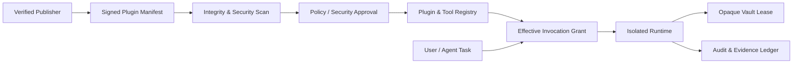
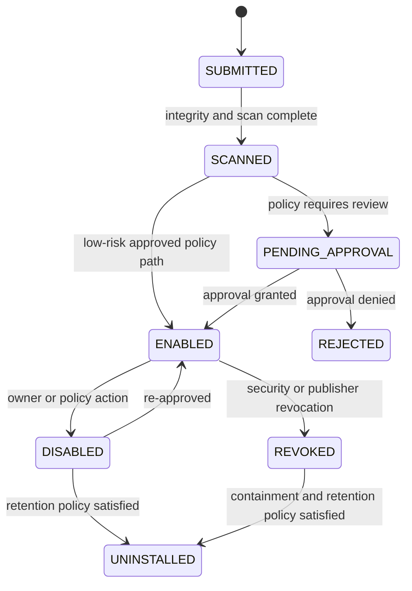

# SPEC-PLATFORM-006 — Plugin & Tool Extension Runtime

| Field | Value |
|---|---|
| **Status** | **APPROVED** — approved by the Project Sponsor on 2026-08-24T17:30:25Z |
| **Specification version** | `0.1.0` |
| **Priority** | Strategic extensibility capability; read-only internal tools before third-party or write-capable extensions |
| **Owning bounded context** | Extension Platform |
| **Primary outcome** | Let AGASTYA add verified capabilities through governed, isolated, versioned plugins and tools without granting unbounded code execution, network access, data access or credential visibility. |
| **Approval record** | `APPROVAL-EXT-001`; Project Sponsor instruction; 2026-08-24T17:30:25Z |
| **Dependencies** | `SPEC-PLATFORM-003`, `SPEC-PLATFORM-004`, `SPEC-PLATFORM-005`, Workspace authorisation and future extension trust/scan services |

---

## 1. Intent and boundary

AGASTYA must extend beyond built-in capabilities without becoming a host for untrusted code or a shortcut around the Agent Control Plane, Evidence Ledger and Secret Vault. The Plugin & Tool Extension Runtime is a control plane and execution boundary for packaged extensions and narrow tool operations.

> **Hard boundary:** An extension is untrusted until its immutable package, publisher, version, capabilities, resource limits, data classification, network egress, secret references and approval state have been verified. A plugin never receives host-level access by default; an agent never invokes an unregistered tool directly.

A **plugin** is a versioned package that may register one or more tools, schemas, UI contributions, policy templates or event consumers. A **tool** is one narrow, typed, callable operation exposed by a registered plugin or built-in implementation. Every tool invocation goes through the existing orchestration policy and tool-broker path. Plugins are capability suppliers; they are not independent agents, policy engines or sources of truth.

### 1.1 In scope

| Capability | Required behaviour |
|---|---|
| **Extension registry** | Maintain immutable plugin manifests, publisher identity, package digest, SBOM/reference, compatibility range, declared tools, capabilities and lifecycle state. |
| **Tool registry** | Register versioned tool contracts with input/output JSON Schemas, risk, required permissions, data classification, egress profile, resource limits and evidence contract. |
| **Trust and approval** | Verify signature/package digest, scan result, publisher trust, policy compatibility and Owner/Security approval before a plugin can be enabled. |
| **Sandboxed execution** | Execute third-party plugin code in an isolated runtime with no host filesystem, process, network, secret or tenant access unless explicitly granted. |
| **Capability-based grants** | Calculate an effective per-invocation grant from project policy, registered tool capability, task context, environment, data classification, secret lease and approval gate. |
| **Secret-safe tool integration** | Request opaque, purpose-bound vault leases; secret materialisation occurs only at registered execution boundary and never returns to agent/plugin logs or output. |
| **Version governance** | Pin invocation to plugin/tool version and package digest; upgrade, rollback, disable, revoke and uninstall through governed lifecycle events. |
| **Evidence and observability** | Emit metadata-only lifecycle, policy, invocation, resource, network and result events to the Evidence Ledger. |

### 1.2 Out of scope

This draft does not approve in-process arbitrary code, native host extensions, direct shell/host filesystem access, unrestricted outbound internet, arbitrary third-party webhook listeners, arbitrary code generation/execution from an agent output, anonymous publishers, a public extension marketplace, or automatic plugin updates. Initial scope is internal and read-only extensions whose packages and publishers are approved.

---

## 2. Security model and invariants

| ID | Invariant |
|---|---|
| **INV-EXT-001** | A plugin package is immutable and identified by publisher, name, version and content digest; a changed package is a new version. |
| **INV-EXT-002** | A plugin may be enabled only after manifest/schema validation, package integrity verification, required scan evidence, policy evaluation and required approval. |
| **INV-EXT-003** | Every tool has explicit input/output contracts, purpose, risk, classification, permission, environment, resource and egress declarations. |
| **INV-EXT-004** | Every tool invocation has one project, task/correlation ID, tool version/digest, effective grant, timeout, budget and audit/evidence record. |
| **INV-EXT-005** | A plugin receives no host filesystem, host process, raw database, raw secret, cross-project data or network capability by default. |
| **INV-EXT-006** | Plugins and tools cannot bypass policy evaluation, the Secret Vault, the Evidence Ledger or required human approval. |
| **INV-EXT-007** | Tool output is schema-validated, size-bounded, classified and redacted before it returns to an agent/user or is persisted as evidence. |
| **INV-EXT-008** | Plugin disablement or revocation immediately prevents new invocations; active work is cancelled, allowed to reach a safe boundary or escalated according to policy. |

### 2.1 Isolation profile

| Boundary | Default | Escalation requirement |
|---|---|---|
| **Compute** | Isolated worker/runtime per execution; CPU, memory, wall-time and concurrency quotas. | Architecture approval for any long-lived or privileged execution. |
| **Filesystem** | Ephemeral, empty workspace; explicit readonly artefact mount only. | Project-scoped, read-only artefact grant and classification check. |
| **Network** | Denied by default. | Registered allowlist, protocol/egress policy, environment and approval. |
| **Data** | No direct database access. | Typed brokered data tool with project/classification policy. |
| **Secrets** | No plaintext and no raw credential environment injection. | Opaque Vault lease and registered tool-bound materialisation only. |
| **Host / shell** | Denied. | Explicitly excluded from initial runtime. |

---

## 3. Domain model and lifecycle



| Entity | Responsibility | Required fields |
|---|---|---|
| **PluginManifest** | Immutable package contract. | Plugin ID, publisher, version, digest, signature, compatibility, package type, declared tools, requested capabilities, SBOM/reference and schemas. |
| **ToolDefinition** | Narrow callable capability. | Tool ID/version, plugin reference, purpose, input/output schemas, risk, data classification, permissions, egress, resources and evidence requirement. |
| **ExtensionGrant** | Effective scoped permission for one plugin/tool in one project/environment. | Project, plugin/tool version, allowed operations, data/artefact scope, egress, secret capabilities, expiry, policy decision and approval. |
| **Invocation** | Durable request/attempt for one tool call. | Invocation ID, correlation/task ID, tool/digest, input hash, grant, state, resource use, output/evidence references. |
| **Publisher** | Identity and trust record for package signer. | Publisher ID, verified keys, status, trust tier, ownership and revocation state. |
| **ScanEvidence** | Integrity, dependency, vulnerability and policy-check result. | Package digest, scanner/version, result, finding summaries, classification and attestation reference. |

### 3.1 Plugin lifecycle



`ENABLED` means eligible for a project-scoped effective grant, not globally callable. A project may enable a compatible plugin only within its own policy boundary. New package content cannot replace an enabled version; upgrade selects a new version/digest through approval, compatibility and rollback controls.

---

## 4. Functional requirements

| ID | Requirement | Priority |
|---|---|---|
| **FREQ-EXT-001** | The system shall register immutable PluginManifests and ToolDefinitions with publisher identity, package digest/signature, version, contracts, capabilities, resources, egress and compatibility metadata. | MUST |
| **FREQ-EXT-002** | The system shall validate manifest, package integrity, publisher trust, scan evidence and policy before enabling any plugin or project extension grant. | MUST |
| **FREQ-EXT-003** | The system shall execute plugin tools only in an isolated runtime with explicit resource limits and no default host, database, network or secret access. | MUST |
| **FREQ-EXT-004** | The system shall calculate an effective invocation grant before each tool execution using project, environment, task, classification, tool, policy, secret and approval context. | MUST |
| **FREQ-EXT-005** | The system shall route every agent-initiated tool call through registered ToolDefinition input/output schemas, policy evaluation and ledger evidence. | MUST |
| **FREQ-EXT-006** | The system shall materialise credentials only through `SPEC-PLATFORM-005` opaque lease and registered execution boundary; plugin or model output must never include secret material. | MUST |
| **FREQ-EXT-007** | The system shall support enable, disable, upgrade, rollback, revoke and uninstall operations as governed versioned lifecycle events. | MUST |
| **FREQ-EXT-008** | The system shall enforce output schema, size, classification, secret-redaction and evidence requirements before returning tool result. | MUST |
| **FREQ-EXT-009** | The system shall record package lifecycle, policy, grant, invocation, resource, egress, output and failure metadata in the Evidence Ledger. | MUST |

### 4.1 Invocation decision sequence

```text
1. Resolve project, user/agent task, environment and exact ToolDefinition digest.
2. Confirm plugin and publisher are enabled, compatible and not revoked.
3. Validate input against tool schema and validate declared purpose.
4. Evaluate project policy, classification, data scope, egress, resource budget, secret requirement and approval gate.
5. Issue one short-lived effective grant or return DENIED / WAITING_APPROVAL.
6. Execute in isolated runtime with only granted mounts, brokered data, allowlisted egress and opaque secret lease.
7. Validate/redact/classify output; persist evidence and return bounded result.
```

---

## 5. Extension package and trust contract

A package manifest must declare no more authority than required. A package cannot request generic `network`, `filesystem`, `database`, `shell` or `secret` authority; it must request narrow named capabilities that map to policy-controlled broker functions.

| Manifest field | Requirement |
|---|---|
| **Identity** | Publisher ID, plugin ID, version, digest, signature and compatibility version range. |
| **Tools** | Unique tool IDs; declared purpose; input/output JSON Schema; required evidence/truth state. |
| **Capabilities** | Named least-privilege data, artefact, egress and secret capability references. |
| **Resources** | Maximum wall time, CPU, memory, output size, concurrency and retry semantics. |
| **Network** | Default denied; explicit target allowlist, protocol, operation/purpose and data classification. |
| **Supply chain** | Package digest, SBOM or dependency reference, scan evidence and publisher attestation. |
| **Lifecycle** | Install/upgrade compatibility, migration statement, deprecation and rollback requirements. |

The initial runtime supports signed internal packages and built-in tools only. External publisher onboarding, marketplace distribution, persistent subscription handlers and write-capable integrations remain gated by future threat model, governance and connector specifications.

---

## 6. Audit, evidence and operational controls

| Event family | Required metadata-only evidence |
|---|---|
| Package lifecycle | Publisher, plugin/version/digest, scan result, approval/policy and state transition. |
| Extension grant | Project, tool, environment, capabilities, classification, expiry and policy decision. |
| Invocation | Correlation/task ID, tool/digest, input hash, grant, resource/egress summary, output hash/classification and truth status. |
| Secret use | Opaque Vault lease/version reference and success/failure code; no secret material. |
| Failure/containment | Timeout, quota, schema violation, policy denial, sandbox violation, revocation or cancellation outcome. |

The runtime integrates with the Audit & Evidence Ledger through append-only authoritative lifecycle and invocation records. Delivery to optional projections is at-least-once; consumers remain idempotent. Tool output cannot claim verified engineering conformance unless the independent verification requirement attached to the ToolDefinition completes.

---

## 7. Acceptance and verification plan

| ID | Given | When | Then | Verification type |
|---|---|---|---|---|
| **AC-EXT-001** | A signed internal package with valid manifest, digest and scan evidence. | It is submitted for registration. | Registry stores immutable metadata and does not enable it until policy/approval requirements are met. | Integration |
| **AC-EXT-002** | A plugin requests undeclared filesystem, host, database, network or secret authority. | It executes or invokes broker. | Runtime/broker denies before access and records containment evidence. | Security |
| **AC-EXT-003** | An approved read-only tool receives valid input. | Invocation passes policy. | It executes in bounded isolation with version/digest, grant, correlation and evidence preserved. | End-to-end |
| **AC-EXT-004** | An agent requests a secret-backed tool call. | Policy permits the operation. | Agent receives no plaintext; tool receives a short-lived opaque Vault lease at execution boundary. | Security |
| **AC-EXT-005** | A plugin version is revoked during queued or active work. | New/active invocation is evaluated. | New executions are denied; active work follows safe cancellation/escalation policy and logs outcome. | Resilience |
| **AC-EXT-006** | Tool output violates schema, exceeds limit or includes secret-like content. | Runtime processes output. | Result is rejected/quarantined/redacted according to policy and unsafe output is not returned to caller. | Security |
| **AC-EXT-007** | A Project A member invokes Project B-enabled tool or artefact scope. | Request is evaluated. | It is denied without leaking cross-project metadata. | Security |

---

## 8. Accepted design risks and child specifications

| ID | Question / child specification | Current status and mandatory gate |
|---|---|---|
| **QUESTION-EXT-001** | Which sandbox technology and execution infrastructure meet initial internal runtime security/resource requirements? | **ACCEPTED_RISK** — resolve through architecture and threat-model approval before execution is enabled. |
| **QUESTION-EXT-002** | What publisher trust tiers, signing process and vulnerability scanning evidence are mandatory for internal and later external publishers? | **ACCEPTED_RISK** — resolve through supply-chain security policy before package onboarding. |
| **QUESTION-EXT-003** | Which read-only internal tools form the initial cohort, and which egress/data capabilities are necessary? | **ACCEPTED_RISK** — resolve through product/security scope before initial tools are enabled. |
| **SPEC-EXT-001** | PluginManifest, Publisher and ToolDefinition schemas. | Required before package registration. |
| **SPEC-EXT-002** | Effective ExtensionGrant, tool invocation and sandbox boundary contract. | Required before execution. |
| **SPEC-EXT-003** | Package signature, scan attestation and trust-tier policy. | Required before third-party packages. |
| **SPEC-EXT-004** | Tool-output redaction, classification and quarantine protocol. | Required before tool results leave runtime. |
| **ADR-EXT-001** | Sandbox technology, isolation limits and deployment/runtime decision. | Required before execution implementation. |

---

## 9. Approval record and implementation authorisation

The Project Sponsor approved `SPEC-PLATFORM-006` version `0.1.0` on **2026-08-24T17:30:25Z**. This approval authorises detailed extension-runtime design and read-only internal-tool planning only. It does not authorise third-party packages, code execution infrastructure, outbound egress, external webhook reception, secret-backed tools, production integrations, automatic updates or write-capable extensions until sandbox, trust, policy, Vault and ledger child contracts are approved.

---

## References

[1] [SPEC-PLATFORM-003 — Multi-Agent Orchestration Layer](file:///Users/mohankrishnagundala/Documents/Agastya/specifications/SPEC-PLATFORM-003.md)
[2] [SPEC-PLATFORM-004 — Event-Driven Audit & Evidence Ledger](file:///Users/mohankrishnagundala/Documents/Agastya/specifications/SPEC-PLATFORM-004.md)
[3] [SPEC-PLATFORM-005 — Secure Credential & Secret Vault Layer](file:///Users/mohankrishnagundala/Documents/Agastya/specifications/SPEC-PLATFORM-005.md)
