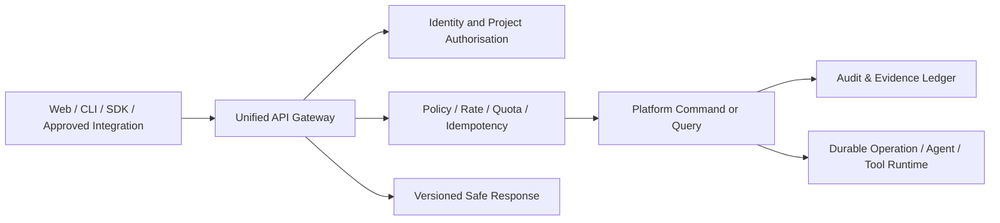

# SPEC-PLATFORM-007 — Unified API Gateway & Client SDK Layer

| Field | Value |
|---|---|
| **Status** | **APPROVED** — approved by the Project Sponsor on 2026-08-24T17:34:08Z |
| **Specification version** | `0.1.0` |
| **Priority** | P0/P1 platform boundary; required for consistent web, CLI, automation, integration and SDK access |
| **Owning bounded context** | Platform API |
| **Primary outcome** | Provide one secure, versioned, contract-first interface for AGASTYA clients and integrations while preserving project isolation, policy decisions, idempotency, auditability and evidence. |
| **Approval record** | `APPROVAL-API-001`; Project Sponsor instruction; 2026-08-24T17:34:08Z |
| **Dependencies** | `SPEC-PLATFORM-001` through `SPEC-PLATFORM-006`, identity provider, Workspace authorisation and Audit & Evidence Ledger |

---

## 1. Intent and boundary

The Unified API Gateway is the only supported external boundary for AGASTYA platform capabilities. It presents stable, versioned resource and command contracts to the web application, CLI, generated SDKs, approved integrations and governed extension consumers. It is not a transparent proxy to internal services and it does not bypass specification, workspace, agent, vault, extension or audit controls.

> **Design objective:** Every API request is authenticated, project-scoped, schema-validated, policy-evaluated, correlated, rate-limited, auditable and represented by a documented versioned contract. SDKs are generated or verified from the same contract and never hold raw secret values.

### 1.1 In scope

| Capability | Required behaviour |
|---|---|
| **Contract-first HTTP API** | Publish OpenAPI-based, versioned REST contracts for platform resources and commands, with schemas, errors, auth scopes and examples. |
| **Gateway policy enforcement** | Authenticate, resolve tenant/project context, authorise role/capability, validate request, apply rate/concurrency/quota controls and create correlation/audit context. |
| **Resource and command patterns** | Support stable resources, optimistic concurrency, idempotent commands and asynchronous operation resources. |
| **Secure API clients** | Support browser sessions and OAuth/OIDC access tokens for humans; service identities and scoped credentials for workloads; no raw secret return paths. |
| **Client SDKs** | Produce versioned TypeScript and Python SDKs from the canonical API contract with auth-provider injection, typed models, retries, pagination, idempotency and error mapping. |
| **Lifecycle compatibility** | Define API/SDK semantic versioning, additive change rules, deprecation notices, compatibility tests and release/changelog evidence. |
| **Observability and audit** | Propagate request/correlation IDs, record material commands/outcomes to Ledger, return safe error envelopes and expose metrics/traces without sensitive payloads. |

### 1.2 Out of scope

The initial layer excludes arbitrary public unauthenticated endpoints, direct database/API passthroughs, GraphQL, generic API key creation, versionless breaking changes, arbitrary third-party webhooks, client-side secret storage, and SDK access to internal administrative/secret material. Webhooks and external event subscriptions require their own signed-delivery and destination-verification specification.

---

## 2. Governing invariants

| ID | Invariant |
|---|---|
| **INV-API-001** | Every request has an authenticated principal or registered service identity, tenant/project context, API version, correlation ID and policy decision. |
| **INV-API-002** | A request cannot read or mutate a project resource unless server-side authorisation confirms membership/capability for that exact project and action. |
| **INV-API-003** | Mutating commands require an idempotency key or concurrency precondition where duplicate/reordered delivery could create an inconsistent result. |
| **INV-API-004** | Gateway validates request and response schemas; client input may never be passed directly into internal commands, tools, SQL, provider calls or event payloads. |
| **INV-API-005** | Long-running work returns an Operation resource with truthful state and evidence references; request threads do not block on agent, verification or tool execution. |
| **INV-API-006** | Material state changes and access denials are recorded as metadata-only Ledger events with correlation/causation links. |
| **INV-API-007** | API contracts and generated SDK versions remain compatible within declared major version; breaking change requires new major version and migration/deprecation evidence. |
| **INV-API-008** | API and SDKs never expose secret plaintext, encrypted secret material, private reasoning, cross-project information or unredacted classified data. |

---

## 3. Architecture and request model



### 3.1 Request processing order

```text
1. Resolve API version and endpoint contract.
2. Authenticate human session/token or service identity.
3. Resolve required tenant/project context from path/claim; reject ambiguity.
4. Authorise action and resource scope through Workspace/policy controls.
5. Apply request-size, content-type, schema, rate, concurrency and quota checks.
6. Resolve idempotency key and optimistic-concurrency precondition for mutation.
7. Create correlation/trace context and execute command/query.
8. Append required metadata-only audit/evidence record and produce typed response.
9. Apply response classification/redaction; emit safe telemetry and return response.
```

| Concern | Standard |
|---|---|
| **Base path** | `/api/v1`; major version in URL; minor/additive revisions described by OpenAPI/SDK release. |
| **Project scope** | Canonical project ID in resource path or explicit command target; never inferred from mutable client-local state. |
| **Errors** | `application/problem+json` with stable code, safe title/detail, correlation ID and retryability; no internal stack, secret or cross-project disclosure. |
| **Pagination** | Stable cursor pagination with bounded page size; no offset assumptions for rapidly changing resources. |
| **Concurrency** | Revision/ETag preconditions for updates; return conflict with current safe version metadata. |
| **Idempotency** | `Idempotency-Key` bound to authenticated principal, project, endpoint and normalised request hash; retain response/status for bounded policy window. |
| **Async work** | Return `202 Accepted` and immutable operation ID; operation query observes `QUEUED`, `RUNNING`, `WAITING_APPROVAL`, `COMPLETED`, `FAILED`, `CANCELLED` or `BLOCKED`. |

---

## 4. Functional requirements

| ID | Requirement | Priority |
|---|---|---|
| **FREQ-API-001** | The system shall publish a canonical OpenAPI contract for all supported `/api/v1` resources and commands, including schemas, scope, errors, examples, lifecycle and SDK generation metadata. | MUST |
| **FREQ-API-002** | The gateway shall authenticate clients, resolve exact tenant/project context and enforce server-side role/capability policy before every query or command. | MUST |
| **FREQ-API-003** | The gateway shall validate request/response schema, content type, size, classification and safe error behaviour for every endpoint. | MUST |
| **FREQ-API-004** | The gateway shall enforce idempotency for applicable commands and optimistic concurrency for versioned resource updates. | MUST |
| **FREQ-API-005** | The gateway shall expose long-running work as durable Operation resources rather than holding synchronous requests open. | MUST |
| **FREQ-API-006** | The gateway shall apply project/client rate limits, concurrency limits and quotas with explicit `429` or policy-blocked outcomes. | MUST |
| **FREQ-API-007** | The gateway shall append metadata-only audit/evidence events for material commands, permission denials, operation lifecycle and security-relevant errors. | MUST |
| **FREQ-API-008** | The system shall generate and publish supported TypeScript and Python SDKs from or contract-test them against the canonical OpenAPI specification. | SHOULD |
| **FREQ-API-009** | SDKs shall accept injected authentication/token providers, support typed errors, cursors, retries for safe/idempotent operations, correlation IDs and SDK/API compatibility metadata. | MUST |
| **FREQ-API-010** | The platform shall define API/SDK deprecation, compatibility and major-version migration policy with contract tests and changelog evidence. | MUST |

### 4.1 Initial resource families

| Resource family | Example scope | Mutating controls |
|---|---|---|
| Projects and membership | `/api/v1/projects/{projectId}` | Owner policy; ETag/idempotency; audit. |
| Specifications and revisions | `/api/v1/projects/{projectId}/specifications` | Version precondition; approval workflow; evidence. |
| Validations, approvals and evidence | `/api/v1/projects/{projectId}/evidence` | Read filtering; append through governed commands. |
| Operations and agent tasks | `/api/v1/projects/{projectId}/operations/{operationId}` | Async state only; cancellation policy; no hidden result claims. |
| Extensions and tools | `/api/v1/projects/{projectId}/extensions` | Project grant + extension policy; no direct plugin bypass. |
| Secret metadata | `/api/v1/projects/{projectId}/secrets` | Metadata-only; no plaintext/export endpoint. |

---

## 5. Security, SDK and compatibility model

| Surface | Required policy |
|---|---|
| **Human clients** | OIDC/OAuth session or access token; project/capability authorisation every request. |
| **Service clients** | Registered workload identity, scoped audience/claims and least-privilege service policy; no generic shared API key. |
| **SDK credentials** | Caller-injected token provider; SDK does not persist plaintext credentials or implement secret retrieval. |
| **CORS / browser** | Explicit allowed origins and credential policy; no wildcard credentialed origins. |
| **SDK retries** | Retry only safe reads or idempotent commands with server-directed retry/backoff; never repeat unsafe non-idempotent mutation. |
| **Versioning** | Additive compatible change within `v1`; explicit deprecation notice/migration guide; breaking behaviour requires `/v2`. |
| **Contract assurance** | Lint OpenAPI, validate examples, run consumer/provider contract tests and SDK smoke tests for every release. |

The SDK is a convenience and consistency layer, not an alternate policy channel. Every SDK call is equivalent to a direct API request and receives the same gateway validation, authorisation, rate, audit and classification controls.

---

## 6. Acceptance and verification plan

| ID | Given | When | Then | Verification type |
|---|---|---|---|---|
| **AC-API-001** | A documented `v1` endpoint and generated client method. | Contract/SDK tests run. | OpenAPI, request/response schema, examples and typed client models remain compatible. | Contract |
| **AC-API-002** | A valid user token but no membership in target project. | Client reads or commands project resource. | Gateway denies without revealing resource existence or metadata. | Security |
| **AC-API-003** | A client retries the same mutating command with same key. | Gateway receives request twice. | One command result is committed and the stable prior response/status is returned. | Integration |
| **AC-API-004** | Two users update a revision using stale/current ETags. | Both mutations arrive. | Current update succeeds; stale update conflicts safely with current safe revision metadata. | Integration |
| **AC-API-005** | A command launches agent/verification/tool work. | Gateway accepts command. | It returns `202` operation resource and preserves truthful state/evidence without blocking request. | End-to-end |
| **AC-API-006** | A client exceeds relevant quota or rate/concurrency limit. | It invokes endpoint. | Gateway returns consistent rate/policy response with correlation ID and no partial command. | Resilience |
| **AC-API-007** | A client sends malformed, oversized or classified-disallowed input. | Gateway validates request. | Request is rejected safely; logs/events exclude unsafe raw content. | Security |
| **AC-API-008** | API version deprecation begins. | Older SDK endpoint is used. | Safe warning/deprecation metadata, compatibility policy and migration guide are available; no silent breaking response. | Contract |

---

## 7. Accepted design risks and child specifications

| ID | Question / child specification | Current status and mandatory gate |
|---|---|---|
| **QUESTION-API-001** | Which identity provider, token format and service-workload credential model serve the initial deployment? | **ACCEPTED_RISK** — resolve through identity/security architecture before gateway deployment. |
| **QUESTION-API-002** | Which gateway/runtime deployment topology satisfies rate, quota, request size and operation event-stream SLOs? | **ACCEPTED_RISK** — resolve through platform architecture/SLO ADR before deployment. |
| **QUESTION-API-003** | What is the first public SDK support policy and deprecation window? | **ACCEPTED_RISK** — resolve through developer-experience policy before SDK publication. |
| **SPEC-API-001** | OpenAPI v1 root document, common schemas, error model and security schemes. | Required before implementation. |
| **SPEC-API-002** | Operation resource, idempotency, ETag and cursor pagination protocol. | Required before mutations/async APIs. |
| **SPEC-API-003** | API audit, telemetry, rate/quota and classification policy contract. | Required before gateway deployment. |
| **SPEC-API-004** | TypeScript/Python SDK generation, compatibility and release process. | Required before SDK publication. |
| **ADR-API-001** | Gateway topology and request policy implementation. | Required before deployment. |

---

## 8. Approval record and implementation authorisation

The Project Sponsor approved `SPEC-PLATFORM-007` version `0.1.0` on **2026-08-24T17:34:08Z**. This approval authorises detailed API contract and SDK design only. It does not authorise public exposure, external integrations, SDK publishing, identity-provider configuration, client credential creation, webhooks or gateway deployment until identity, operation, rate/audit and child contract decisions are approved.

---

## References

[1] [SPEC-PLATFORM-001 — Canonical Specification Core](file:///Users/mohankrishnagundala/Documents/Agastya/specifications/SPEC-PLATFORM-001.md)
[2] [SPEC-PLATFORM-003 — Multi-Agent Orchestration Layer](file:///Users/mohankrishnagundala/Documents/Agastya/specifications/SPEC-PLATFORM-003.md)
[3] [SPEC-PLATFORM-004 — Event-Driven Audit & Evidence Ledger](file:///Users/mohankrishnagundala/Documents/Agastya/specifications/SPEC-PLATFORM-004.md)
[4] [SPEC-PLATFORM-005 — Secure Credential & Secret Vault Layer](file:///Users/mohankrishnagundala/Documents/Agastya/specifications/SPEC-PLATFORM-005.md)
