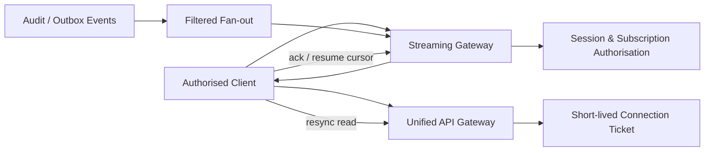

# SPEC-PLATFORM-008 — Real-Time Streaming & WebSocket Subscriptions Layer

| Field | Value |
|---|---|
| **Status** | **APPROVED** — approved by the Project Sponsor on 2026-08-24T17:38:18Z |
| **Specification version** | `0.1.0` |
| **Priority** | P1/P2 experience and control-plane capability; correctness remains grounded in API resources and Evidence Ledger |
| **Owning bounded context** | Real-Time Delivery |
| **Primary outcome** | Deliver authorised, project-scoped state-change notifications with bounded replay and recovery semantics, without treating a WebSocket message as the authoritative record. |
| **Approval record** | `APPROVAL-STREAM-001`; Project Sponsor instruction; 2026-08-24T17:38:18Z |
| **Dependencies** | `SPEC-PLATFORM-004`, `SPEC-PLATFORM-007`, Workspace authorisation, durable event/outbox delivery and operation resources |

---

## 1. Intent and boundary

The Real-Time Streaming & WebSocket Subscriptions Layer keeps authorised AGASTYA clients current when operations, agent tasks, validations, approvals, evidence, extensions or other relevant project state changes. It is a delivery plane, not a source of truth. The authoritative decision, event and resource remain in the platform API and Evidence Ledger.

> **Delivery truth rule:** A real-time message tells a client that a scoped state change is available. The message must contain enough safe metadata to update a view, but the client can always re-read the versioned API resource or resume from a durable cursor. Lost, duplicate, late or disconnected delivery must never change engineering truth.

### 1.1 In scope

| Capability | Required behaviour |
|---|---|
| **Authorised WebSocket sessions** | Establish a connection only through an authenticated Gateway-issued, short-lived connection credential; bind session to principal, tenant, project scope, client and expiration. |
| **Named subscriptions** | Permit explicit, registered project-scoped channels such as operation status, agent task status, validation, approval, evidence summary and notification channels. |
| **Durable event fan-out** | Consume authoritative outbox/ledger-derived delivery events and fan them out after project/channel/classification filtering. Clients cannot publish platform events. |
| **Bounded replay/resume** | Include stream event ID and cursor; allow resume from retained channel cursor or require safe resynchronisation through API when cursor is unavailable. |
| **Ordering and deduplication** | Guarantee order only within a defined project/channel partition; clients deduplicate by immutable stream event ID and must not assume global ordering. |
| **Backpressure and recovery** | Use bounded per-session buffers, acknowledgements/heartbeats and flow control; slow consumers receive resync-required or controlled close rather than unbounded memory use. |
| **Safe data delivery** | Validate event schema, classification, payload size and redaction before delivery; no secret/plaintext, private reasoning or cross-project event data. |
| **Observability and audit** | Record session, subscription, delivery, denial, replay, backpressure, reauthentication and disconnect metadata as safe evidence. |

### 1.2 Out of scope

The initial specification excludes client-originated event publication, generic arbitrary topic patterns, raw audit-ledger export over WebSockets, direct WebSocket access to internal services, peer-to-peer collaboration state, end-to-end message encryption, permanent connection credentials, cross-project subscriptions, and guaranteed exactly-once delivery. The platform supports an API polling/re-read fallback for every streamed resource.

---

## 2. Delivery semantics and invariants

| ID | Invariant |
|---|---|
| **INV-STREAM-001** | Every connection, subscription and event is bound to one authenticated principal/service identity, tenant, project, channel, classification policy and expiration. |
| **INV-STREAM-002** | The Gateway authorises subscription creation and reauthorises it on token renewal/policy change; no client-selected topic may expand project or capability scope. |
| **INV-STREAM-003** | Stream events derive from authoritative outbox/ledger events or bounded projections and carry source event reference, stream event ID, project/channel cursor and correlation ID. |
| **INV-STREAM-004** | Delivery is at-least-once within retained replay window; clients deduplicate by stream event ID and ordering is defined only per project/channel partition. |
| **INV-STREAM-005** | No message declares a resource or verification result authoritative beyond its evidence/truth state. API re-read and cursor resume are the recovery mechanisms. |
| **INV-STREAM-006** | The runtime maintains bounded buffers and does not permit one slow connection to exhaust worker/process memory, queue capacity or other tenant delivery. |
| **INV-STREAM-007** | Stream payloads are schema-validated, classification-filtered, size-bounded and redacted before delivery and telemetry; secret material and private reasoning are prohibited. |
| **INV-STREAM-008** | Connection/session lifecycle and security-relevant subscription outcomes are recorded as metadata-only audit/evidence events. |

### 2.1 Channel registry

| Channel | Project scope | Safe payload summary | Source |
|---|---|---|---|
| `operation.status` | Exact operation project | Operation ID, state, truth state, safe progress summary, evidence/API reference. | Operation lifecycle events. |
| `agent_task.status` | Exact task project | Task ID, state, policy/approval status, safe result reference. | Orchestration events. |
| `validation.status` | Exact validation project | Validation ID, state, verdict, requirement/evidence reference. | Verification events. |
| `approval.status` | Exact approval project | Approval ID, state, safe decision metadata. | Approval events. |
| `evidence.summary` | Exact evidence project | Evidence ID, subject reference, classification-safe truth/status. | Evidence Ledger events. |
| `notification` | Exact project/user capability | Registered non-sensitive notification envelope. | Policy-approved notification source. |

Channels are allowlisted in the registry. A subscription request identifies channel and project; the Gateway maps it to an effective capability. Wildcards, arbitrary event-type filters and client-provided query predicates are excluded from the initial release.

---

## 3. Architecture and session lifecycle



### 3.1 Session and subscription sequence

```text
1. Client authenticates through the Unified API Gateway and requests a short-lived connection ticket.
2. Gateway validates client, tenant/project scope, channels, classification and policy; ticket is one-time or tightly replay-limited.
3. Client opens WebSocket and proves connection ticket; streaming runtime establishes bounded session.
4. Client requests registered channel subscription with optional last acknowledged cursor.
5. Runtime authorises channel/project, validates replay window and either replays retained events or emits RESYNC_REQUIRED.
6. Runtime delivers schema-validated, filtered events; client acknowledges processed cursor/event ID as protocol requires.
7. On heartbeat, token expiry, policy change, buffer pressure or disconnect, runtime reauthorises, limits, closes or requires resync safely.
```

Connection credentials are not sent in URL query strings. The client uses the authenticated Gateway to obtain a short-lived ticket and provides it through the protocol-approved handshake mechanism. The ticket binds the intended client/project/channel policy and cannot become a general API or secret credential.

### 3.2 Replay and consistency model

A client that needs an initial coherent view first reads the relevant API resource/list and records the returned high-watermark cursor. It then subscribes from that cursor. If it reconnects within retention, it sends the last acknowledged cursor and receives replay. If the cursor is expired, invalid, unauthorised or outside a retained partition, the runtime sends `RESYNC_REQUIRED` and the client must re-read the authoritative API before resubscribing.

The protocol explicitly permits duplicate events and does not promise global ordering. It guarantees a monotonic cursor only for the declared project/channel partition. Clients must treat an event as a notification about a resource/operation version and apply idempotent update logic.

---

## 4. Functional requirements

| ID | Requirement | Priority |
|---|---|---|
| **FREQ-STREAM-001** | The system shall issue short-lived Gateway-authorised connection tickets and establish WebSocket sessions only after identity, tenant/project scope, channel policy and expiration validation. | MUST |
| **FREQ-STREAM-002** | The system shall maintain a registered channel catalogue and permit only exact authorised project-scoped subscriptions. | MUST |
| **FREQ-STREAM-003** | The system shall produce stream events from authoritative outbox/ledger-derived event sources and include immutable stream event ID, source reference, cursor, correlation ID, channel and safe payload. | MUST |
| **FREQ-STREAM-004** | The system shall provide retained bounded replay/resume by project/channel cursor and emit `RESYNC_REQUIRED` when safe replay cannot be provided. | MUST |
| **FREQ-STREAM-005** | The system shall enforce bounded buffers, acknowledgement/heartbeat policy, rate limits and slow-consumer handling for each session. | MUST |
| **FREQ-STREAM-006** | The system shall validate and redact/classify stream payloads before delivery, prohibit sensitive material and prevent cross-project messages. | MUST |
| **FREQ-STREAM-007** | The system shall support token/session reauthorisation and immediate subscription termination on expiry, membership/policy revocation or channel disablement. | MUST |
| **FREQ-STREAM-008** | The system shall record safe session, subscription, delivery, denial, replay, resync, backpressure and disconnect metadata in the Evidence Ledger. | MUST |
| **FREQ-STREAM-009** | The client SDK shall provide typed subscription events, cursor storage hooks, idempotent event helpers, reconnect/resync signalling and API fallback guidance. | SHOULD |

---

## 5. Backpressure, resilience and safety controls

| Condition | Required behaviour |
|---|---|
| **Slow consumer / unacknowledged buffer** | Stop or reduce fan-out, emit a safe control message when possible, then close with resumable cursor or `RESYNC_REQUIRED`; never grow unbounded memory. |
| **Reconnect within retention** | Reauthorise and replay at-least-once events from last acknowledged cursor. |
| **Reconnect outside retention** | Emit `RESYNC_REQUIRED`; client re-reads authoritative API and starts at new high-watermark. |
| **Duplicate event** | Client discards by stream event ID or safely applies idempotent resource-version update. |
| **Source event delivery retry** | Fan-out remains at-least-once and never invents authoritative state; dedupe source/stream event IDs. |
| **Auth / membership change** | Reevaluate session/subscription; terminate affected channels immediately and prevent further delivery. |
| **Schema or classification violation** | Quarantine/deny event delivery, record safe failure metadata and alert through operational policy. |
| **Runtime restart** | Session is re-established through Gateway; cursor replay/resync restores safe client state. |

The streaming runtime needs a persistent process or equivalent managed real-time execution environment, but the deployment choice is intentionally deferred to the streaming runtime ADR. The default sandbox is not an execution target for a production WebSocket service.

---

## 6. Acceptance and verification plan

| ID | Given | When | Then | Verification type |
|---|---|---|---|---|
| **AC-STREAM-001** | An authenticated project member requests a ticket and allowed channel. | Connection/subscription is established. | Session is bound to exact project/channel, expiration and correlation evidence. | Integration |
| **AC-STREAM-002** | A member requests another project or unregistered channel. | Subscription is evaluated. | It is denied without event/resource disclosure. | Security |
| **AC-STREAM-003** | Authoritative operation/validation event is emitted. | Fan-out creates stream event. | Safe event carries source reference, ID, cursor, channel and classification-filtered payload. | Contract |
| **AC-STREAM-004** | Client reconnects inside/outside retained cursor window. | It submits last cursor. | It receives at-least-once replay or `RESYNC_REQUIRED` requiring API re-read. | End-to-end |
| **AC-STREAM-005** | A client stops acknowledging and buffer reaches policy limit. | Runtime continues receiving events. | It applies bounded backpressure and closes/resyncs safely without affecting other sessions. | Resilience |
| **AC-STREAM-006** | A user loses membership or access policy changes mid-session. | Runtime reauthorises. | Affected channel terminates immediately; future events are withheld. | Security |
| **AC-STREAM-007** | Source payload includes prohibited secret/classified fields. | Event is transformed for delivery. | Unsafe delivery is denied/quarantined and no prohibited material reaches session/telemetry. | Security |
| **AC-STREAM-008** | SDK consumer receives duplicate or out-of-order cross-channel events. | It processes delivery. | Helper preserves idempotency and documents only per-channel cursor ordering. | Contract |

---

## 7. Accepted design risks and child specifications

| ID | Question / child specification | Current status and mandatory gate |
|---|---|---|
| **QUESTION-STREAM-001** | Which managed real-time runtime/topology will support persistent connections, session routing, replay buffer and required SLOs? | **ACCEPTED_RISK** — resolve through deployment/runtime ADR before service deployment. |
| **QUESTION-STREAM-002** | What retention duration, event-size/buffer limits and per-plan connection/subscription quotas apply? | **ACCEPTED_RISK** — resolve through product/operational policy before channel enablement. |
| **QUESTION-STREAM-003** | Which initial channels are sufficient for P1 user experience, and what classification rules apply to each? | **ACCEPTED_RISK** — resolve through product/security scope before initial channels are enabled. |
| **SPEC-STREAM-001** | WebSocket protocol, connection ticket, control-message and channel event schemas. | Required before implementation. |
| **SPEC-STREAM-002** | Cursor/replay, acknowledgement, resync and deduplication contract. | Required before client implementation. |
| **SPEC-STREAM-003** | Backpressure, rate/quota, presence and session-revocation policy. | Required before runtime deployment. |
| **SPEC-STREAM-004** | TypeScript/Python SDK subscription and recovery contract. | Required before SDK streaming support. |
| **ADR-STREAM-001** | Persistent runtime, event fan-out, replay store and operational SLO topology. | Required before deployment. |

---

## 8. Approval record and implementation authorisation

The Project Sponsor approved `SPEC-PLATFORM-008` version `0.1.0` on **2026-08-24T17:38:18Z**. This approval authorises detailed protocol, client recovery and runtime design only. It does not authorise persistent service deployment, public WebSocket exposure, external event subscriptions, presence/collaboration, queue/routing infrastructure, retention configuration or channel enablement until runtime, security, quota and child-contract decisions are approved.

---

## References

[1] [SPEC-PLATFORM-004 — Event-Driven Audit & Evidence Ledger](file:///Users/mohankrishnagundala/Documents/Agastya/specifications/SPEC-PLATFORM-004.md)
[2] [SPEC-PLATFORM-007 — Unified API Gateway & Client SDK Layer](file:///Users/mohankrishnagundala/Documents/Agastya/specifications/SPEC-PLATFORM-007.md)
