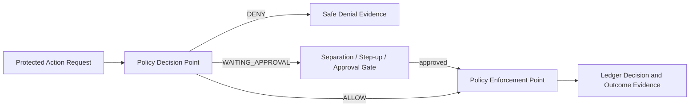

# SPEC-PLATFORM-009 — Enterprise Security & RBAC Governance Layer

| Field | Value |
|---|---|
| **Status** | **APPROVED** — approved by the Project Sponsor on 2026-08-24T17:41:47Z |
| **Specification version** | `0.1.0` |
| **Priority** | Cross-cutting enterprise control plane; governs all platform boundaries |
| **Owning bounded context** | Identity, Access and Governance |
| **Primary outcome** | Enforce least-privilege, tenant/project-scoped, policy-backed access decisions consistently across the API, CLI, workers, agents, extensions, secrets and real-time delivery. |
| **Approval record** | `APPROVAL-GOV-001`; Project Sponsor instruction; 2026-08-24T17:41:47Z |
| **Dependencies** | `SPEC-PLATFORM-002` through `SPEC-PLATFORM-008`, enterprise identity provider and Audit & Evidence Ledger |

---

## 1. Intent and boundary

AGASTYA requires more than static roles. Enterprise governance must combine versioned role/capability assignments with contextual policy decisions, approval gates, separation of duties, session/workload controls and durable evidence. The security layer is a **Policy Decision Point** and policy model. APIs, background workers, tools, Vault, streaming runtime and extensions are **Policy Enforcement Points** and may never grant access by default.

> **Security decision rule:** Every protected action must resolve an authenticated identity, tenant, exact resource/project scope, role/capabilities, contextual attributes, policy version and decision. If any required fact is missing, stale, ambiguous or denied, the action must not proceed.

### 1.1 In scope

| Capability | Required behaviour |
|---|---|
| **Enterprise identity** | Map human, group, service workload, agent and break-glass identities to an organisation tenant through approved federated identity and session controls. |
| **RBAC plus contextual policy** | Assign versioned roles at tenant/project scope; evaluate capabilities alongside resource classification, environment, action, identity assurance, time-bound grant and approval state. |
| **Role governance** | Manage role assignments, delegations, expiry, review and revocation without privilege escalation. |
| **Separation of duties** | Enforce policy for specification approval, security governance, privileged access, secret/break-glass actions and high-risk release operations. |
| **Privileged access** | Require stronger authentication, explicit purpose, just-in-time grant, short expiry, enhanced audit and post-event review for sensitive actions. |
| **Workload/agent access** | Grant registered services, workers, tools and agents minimal non-human capabilities only for their exact project/task/purpose. |
| **Enforcement and evidence** | Require PEP enforcement across every gateway/runtime; append policy decision and sensitive access evidence to Ledger. |
| **Policy lifecycle** | Version, test/simulate, approve, activate, supersede and roll back policy without silently changing historical decision provenance. |

### 1.2 Out of scope

The draft does not approve a specific identity provider, SCIM directory provisioning, a general-purpose policy language, customer-managed cryptographic keys, unrestricted platform superuser access, permanent privileged roles, or deployment of a production identity service. It does not replace the Secret Vault’s cryptographic boundary or the Workspace specification’s role baseline.

---

## 2. Role, capability and policy model

| Role | Scope | Baseline capability boundary |
|---|---|---|
| **Tenant Administrator** | Tenant | Tenant configuration and role governance; no implicit project-content read or secret plaintext access. |
| **Security Administrator** | Tenant | Security policy, identity assurance and incident controls; separation from ordinary project approval. |
| **Project Owner** | One project | Membership, project configuration and approval delegation within policy; no automatic security-administration power. |
| **Project Editor** | One project | Create/edit proposed content and bounded commands; cannot approve own governed changes. |
| **Project Viewer** | One project | Read permitted classified content only. |
| **Auditor** | Tenant/project | Read audit/evidence under classification policy; cannot mutate engineering or policy state. |
| **Service / Worker Identity** | Exact service/project/purpose | Non-human minimal capability for registered operation only. |
| **Agent Identity** | Exact task/project/policy | Cannot self-escalate, approve, change policy or access plaintext secrets. |
| **Break-Glass Principal** | Exceptional temporary scope | Multi-party approved short-lived privileged operation with enhanced review. |

Role assignments are grants, not broad authority. Effective permission is:

```text
Identity + authenticated assurance + tenant/project scope + assigned role/capability
+ resource classification + environment + requested action + policy version
+ time-bound grant + required approval = ALLOW / DENY / WAITING_APPROVAL
```

### 2.1 Mandatory invariants

| ID | Invariant |
|---|---|
| **INV-GOV-001** | Every identity, role assignment, capability grant, resource and policy decision is tenant-scoped; project actions require exact project scope. |
| **INV-GOV-002** | Every enforcement point uses a deny-by-default policy decision before protected action and persists decision version/provenance for material actions. |
| **INV-GOV-003** | Roles are capability bundles with explicit scope, start/expiry, grantor, purpose and lifecycle; assignment cannot grant beyond grantor’s own delegable authority. |
| **INV-GOV-004** | High-risk actions require required identity assurance, separation-of-duties checks and approval gates before the sensitive action occurs. |
| **INV-GOV-005** | Agents, workers, tools and services use non-human identities and minimum capabilities; they never inherit an interactive user’s unlimited permissions. |
| **INV-GOV-006** | Policy changes are versioned, tested/simulated, approved, activated and auditable; historic decisions retain their evaluated policy version. |
| **INV-GOV-007** | Revocation/expiry/policy change prevents new protected action immediately and terminates active access where protocol/runtime supports it. |
| **INV-GOV-008** | Security decisions, denials, role changes, privileged access and policy lifecycle events are metadata-only Ledger evidence. |

---

## 3. Functional requirements

| ID | Requirement | Priority |
|---|---|---|
| **FREQ-GOV-001** | The system shall map authenticated humans, groups, services, agents and break-glass identities to tenant-scoped identity records and assurance attributes. | MUST |
| **FREQ-GOV-002** | The system shall define versioned role/capability bundles and scope-bound assignments with grantor, purpose, start, expiry, review and revocation metadata. | MUST |
| **FREQ-GOV-003** | The system shall evaluate a policy decision before every protected API, CLI, worker, agent, extension, Vault and streaming operation. | MUST |
| **FREQ-GOV-004** | The system shall enforce separation-of-duties policies preventing conflicted self-approval, self-escalation and prohibited policy/approval combinations. | MUST |
| **FREQ-GOV-005** | The system shall require step-up assurance and just-in-time approval for configured privileged actions, including security policy, secret lifecycle, role governance and high-risk release actions. | MUST |
| **FREQ-GOV-006** | The system shall issue narrowly scoped non-human grants for registered workloads/agents/tools that expire and cannot be delegated or self-escalated. | MUST |
| **FREQ-GOV-007** | The system shall version, simulate/test, approve, activate, supersede and roll back policy, retaining decision provenance. | MUST |
| **FREQ-GOV-008** | The system shall revoke/deactivate sessions, grants and subscriptions on expiry, identity removal, role change or policy decision. | MUST |
| **FREQ-GOV-009** | The system shall emit Ledger evidence for role/grant, policy, approval, privileged-access and access-denial lifecycle events. | MUST |

### 3.1 Enforcement matrix

| Enforcement point | Required input | Enforced result |
|---|---|---|
| API / CLI Gateway | Identity, project/resource, action, scope, policy | Authorise request, rate/step-up/approval or deny. |
| Agent/worker orchestration | Task/specification, agent identity, tool purpose, environment | Effective grant or blocked task. |
| Plugin/tool runtime | Plugin/tool digest, invocation grant, data/egress/secret request | Brokered named capability or containment denial. |
| Secret Vault | Secret classification, lease subject/purpose/environment | Opaque lease or deny; no plaintext API result. |
| Streaming runtime | Session identity, project/channel, expiry, classification | Deliver, terminate or resync without cross-project data. |

---

## 4. Privileged access, approvals and policy lifecycle

A privileged action is identified by resource classification, environment, action risk and policy. It needs a specific purpose, stronger assurance where policy requires it, limited duration, distinct approver where separation of duties applies, and Ledger evidence. Break-glass is an exception path—not a stronger role. It requires the declared emergency reason, multi-party approval, a minimal time-bound scope, active monitoring and mandatory post-event review.



Policy simulation runs with historical/synthetic decision inputs and reports changed allow/deny outcomes before activation. Activation cannot silently rewrite prior decisions; a later revocation applies prospectively and triggers session/grant termination according to each runtime’s enforcement contract.

---

## 5. Acceptance and verification plan

| ID | Given | When | Then | Verification type |
|---|---|---|---|---|
| **AC-GOV-001** | A valid identity with scoped Project Viewer role. | It reads allowed/disallowed classified project resources. | Policy permits only allowed resource/classification and produces safe denial otherwise. | Security |
| **AC-GOV-002** | Project Editor created a governed change. | Same Editor attempts approval. | Separation policy blocks self-approval and records decision. | Security |
| **AC-GOV-003** | Tenant Admin delegates a role. | Requested scope/capability exceeds delegable authority. | Assignment is denied with no privilege escalation. | Security |
| **AC-GOV-004** | A configured privileged action is requested without step-up/approval. | PEP evaluates action. | It enters waiting approval or is denied before sensitive action. | Integration |
| **AC-GOV-005** | Registered agent/tool requests protected capability. | PDP evaluates exact task/project/purpose. | It receives only narrow expiring grant or denial; it cannot self-delegate. | Security |
| **AC-GOV-006** | A policy change is proposed and simulated. | Approval/activation occurs. | Versioned simulation/approval evidence exists and historic decisions retain former version. | Contract |
| **AC-GOV-007** | Membership, role or policy is revoked during API/stream/worker operation. | PEP reauthorises. | New action is denied and active access terminates or transitions safely. | End-to-end |
| **AC-GOV-008** | Auditor reads governance evidence. | Query is executed. | Auditor receives permitted evidence without mutation/secret/classification escalation. | Security |

---

## 6. Accepted design risks and child specifications

| ID | Question / child specification | Current status and mandatory gate |
|---|---|---|
| **QUESTION-GOV-001** | Which federated identity provider, MFA/step-up claims and session/revocation model apply? | **ACCEPTED_RISK** — resolve through identity/security architecture before implementation. |
| **QUESTION-GOV-002** | Which policy expression/evaluation technology meets explainability, versioning and test requirements? | **ACCEPTED_RISK** — resolve through policy-engine ADR before PEP implementation. |
| **QUESTION-GOV-003** | What separation-of-duties matrix and privileged-action taxonomy applies to initial enterprise tiers? | **ACCEPTED_RISK** — resolve through governance/product policy before privileged access is enabled. |
| **SPEC-GOV-001** | Identity, role, capability, assignment and delegation schemas. | Required before RBAC implementation. |
| **SPEC-GOV-002** | Policy decision request/response, provenance and simulation contract. | Required before PEP integration. |
| **SPEC-GOV-003** | Step-up, JIT, break-glass, separation-of-duties and review workflows. | Required before privileged access. |
| **SPEC-GOV-004** | Access-review, revocation and session termination event contract. | Required before enterprise lifecycle operations. |
| **ADR-GOV-001** | Identity and policy engine architecture. | Required before deployment. |

---

## 7. Approval record and implementation authorisation

The Project Sponsor approved `SPEC-PLATFORM-009` version `0.1.0` on **2026-08-24T17:41:47Z**. This approval authorises detailed identity, role, policy, separation-of-duties and enforcement design only. It does not authorise identity-provider configuration, customer SSO/SCIM, production role provisioning, break-glass activation, policy-engine deployment, tenant administration or external directory integration until the identity, policy and privileged-access child contracts are approved.

---

## References

[1] [SPEC-PLATFORM-002 — Project Workspace Boundary](file:///Users/mohankrishnagundala/Documents/Agastya/specifications/SPEC-PLATFORM-002.md)
[2] [SPEC-PLATFORM-004 — Event-Driven Audit & Evidence Ledger](file:///Users/mohankrishnagundala/Documents/Agastya/specifications/SPEC-PLATFORM-004.md)
[3] [SPEC-PLATFORM-005 — Secure Credential & Secret Vault Layer](file:///Users/mohankrishnagundala/Documents/Agastya/specifications/SPEC-PLATFORM-005.md)
[4] [SPEC-PLATFORM-007 — Unified API Gateway & Client SDK Layer](file:///Users/mohankrishnagundala/Documents/Agastya/specifications/SPEC-PLATFORM-007.md)
