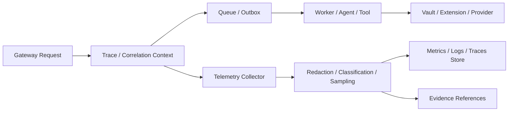

# SPEC-PLATFORM-010 — Observability, Telemetry & Distributed Tracing Layer

| Field | Value |
|---|---|
| **Status** | **APPROVED** — approved by the Project Sponsor on 2026-08-24T17:46:09Z |
| **Specification version** | `0.1.0` |
| **Priority** | Cross-cutting P0/P1 operational foundation |
| **Owning bounded context** | Platform Observability |
| **Primary outcome** | Produce safe, correlated metrics, logs and traces that explain platform behaviour, link operational signals to governed evidence, and enable measurable reliability without leaking secrets or changing engineering truth. |
| **Approval record** | `APPROVAL-OBS-001`; Project Sponsor instruction; 2026-08-24T17:46:09Z |
| **Dependencies** | `SPEC-PLATFORM-004`, `SPEC-PLATFORM-007`, `SPEC-PLATFORM-009`, all service/worker/agent/runtime boundaries |

---

## 1. Intent and boundary

Observability lets AGASTYA answer what happened, where it happened, how long it took, what failed, and which governed operation or evidence record it affected. It collects three complementary signal types: **metrics** for aggregate health, **structured logs** for diagnostic records, and **traces** for causal request/task paths across synchronous and asynchronous work.

> **Truth boundary:** Telemetry supports investigation and operational response. It does not replace authoritative specification, approval, verification, audit or evidence records. A telemetry signal may link to a Ledger event or governed resource, but it cannot independently assert verified engineering conformance.

### 1.1 In scope

| Capability | Required behaviour |
|---|---|
| **Correlation model** | Propagate trace, span, correlation, request, tenant/project, operation/task, specification and ledger-event references across Gateway, workers, queues, agents, tools, Vault, extensions and streaming. |
| **Signal contracts** | Standardise structured metric/log/trace attributes, naming, severity, cardinality, classification, schema version and ownership. |
| **Safe collection** | Allowlist attributes, redact/block secret/private-reasoning/raw credential data, bound payloads and classify telemetry before export/storage. |
| **Async trace continuity** | Continue causal context through durable queues, outbox events, scheduled work, agent attempts, tool calls, retry and replay operations. |
| **Service health and SLOs** | Define service objectives/indicators for API, workers, ledger/outbox, policy, Vault, extensions and streaming; measure error, latency, availability, queue and saturation signals. |
| **Operational investigation** | Link safe telemetry to operation/task/resource/evidence identifiers and provide access-controlled trace/log/metric exploration. |
| **Sampling and cost control** | Apply documented sampling, aggregation, retention, quota and high-cardinality policy without losing mandatory error/security/decision evidence. |
| **Alert evidence** | Emit governed alert/incident signals with correlation, severity and safe runbook/evidence references; notification routing is deferred. |

### 1.2 Out of scope

The initial design excludes session replay, unrestricted payload capture, unbounded raw log retention, customer behavioural analytics, private model reasoning capture, secrets/credential telemetry, a specific vendor deployment, automatic incident remediation, and external alert destinations. It does not convert every log into an audit event.

---

## 2. Signal, correlation and safety model

| Signal | Purpose | Required safe attributes |
|---|---|---|
| **Metric** | Aggregate latency, error, throughput, queue, saturation and resource health. | Service/component, operation class, outcome, bounded tenant/project plan bucket where approved; no raw IDs/high-cardinality labels. |
| **Structured log** | Diagnostic event for operation, error or policy outcome. | Timestamp, severity, component, correlation/trace IDs, safe error code, resource/evidence reference, classification. |
| **Trace / span** | Causal path and duration through APIs, queues, workers and integrations. | Trace/span/parent IDs, component, operation, outcome, safe tenant/project/resource references, retry/attempt. |

Every signal is subject to telemetry classification and data minimisation. Attribute keys are allowlisted; free-form raw request bodies, headers, tokens, prompt content, secret values, ciphertext, private reasoning, database connection strings and unbounded identifiers are prohibited. The collector rejects/quarantines non-conforming telemetry and records safe sanitisation evidence.

### 2.1 Mandatory invariants

| ID | Invariant |
|---|---|
| **INV-OBS-001** | Every platform boundary emits a correlation context and preserves it across approved asynchronous handoffs or records a safe causal link. |
| **INV-OBS-002** | Telemetry attributes use versioned, allowlisted schemas and classification; collectors reject/redact prohibited or oversized data before storage/export. |
| **INV-OBS-003** | Metrics avoid raw high-cardinality identifiers; detailed resource/task/evidence information belongs in access-controlled traces/logs or Ledger references. |
| **INV-OBS-004** | Errors, security denials, policy decisions, retries, timeouts and mandatory operational outcomes receive protected sampling/retention according to policy. |
| **INV-OBS-005** | Trace/log/metric readers are governed by tenant/project/classification policy and cannot use telemetry to bypass resource access controls. |
| **INV-OBS-006** | SLO calculations use defined indicators/windows/objectives and identify source version/ownership; alert signals do not automatically execute remediation. |
| **INV-OBS-007** | Telemetry links to authoritative records through safe references and never alters their truth status. |

---

## 3. Functional requirements

| ID | Requirement | Priority |
|---|---|---|
| **FREQ-OBS-001** | The system shall define a canonical versioned telemetry context including trace/span, correlation/request, tenant/project, operation/task, retry and safe source/evidence references. | MUST |
| **FREQ-OBS-002** | The system shall propagate or causally link context across API, queue, worker, outbox, agent, tool, Vault, extension and streaming boundaries. | MUST |
| **FREQ-OBS-003** | The system shall collect schema-valid metrics, structured logs and traces with allowlisted attributes, classification, payload limits and redaction before persistence/export. | MUST |
| **FREQ-OBS-004** | The system shall define and calculate SLI/SLO measures for critical components, including latency, error, availability, queue/saturation and policy/worker outcome. | MUST |
| **FREQ-OBS-005** | The system shall apply documented sampling, retention, aggregation, quota and cardinality controls while preserving mandatory error/security/decision signals. | MUST |
| **FREQ-OBS-006** | The system shall expose access-controlled telemetry exploration linked to safe resource/operation/task/evidence references. | MUST |
| **FREQ-OBS-007** | The system shall generate correlated alert/incident signals for SLO breach and critical operational/security conditions without automatic remediation. | SHOULD |
| **FREQ-OBS-008** | The system shall record collector sanitisation, telemetry policy, SLO definition, alert and relevant operational outcomes as Ledger evidence. | MUST |

---

## 4. SLO, sampling and access controls

| Area | Initial SLI examples | Control |
|---|---|---|
| API Gateway | Availability, server error rate, latency by operation class, throttle rate. | Project/client-safe aggregation; no raw request payload labels. |
| Durable tasks | Queue age, lease recovery, terminal failure, completion latency. | Link safe task/operation reference in traces. |
| Ledger/outbox | Append failure, delivery lag, consumer retry/dead-letter rate. | Preserve source event reference and partition aggregate. |
| Policy/Vault | Decision latency/deny rate, lease/revocation outcome, sanitisation rejection. | Never include secret material or sensitive decision content. |
| Extensions/streaming | Sandbox violation, resource limit, session backpressure, replay/resync rate. | Bound cardinality and classification-filter outputs. |

Sampling is an explicit policy. Successful high-volume traces may be sampled; errors, security denials, policy changes, privileged access, ledger integrity failures, sanitisation events and SLO-breach evidence are retained under stricter policy. Sampling must retain correlation/reference information necessary to explain the captured outcome.

---

## 5. Acceptance and verification plan

| ID | Given | When | Then | Verification type |
|---|---|---|---|---|
| **AC-OBS-001** | A gateway request launches asynchronous worker/agent/tool work. | The work completes or fails. | Trace/correlation context links gateway, queue, attempt, tool and safe evidence/resource references. | Integration |
| **AC-OBS-002** | A telemetry record contains secret-like, prohibited or oversized attribute. | Collector validates it. | Sensitive material is rejected/redacted before storage/export and sanitisation evidence is recorded. | Security |
| **AC-OBS-003** | A high-volume operation emits metrics/traces. | Sampling/cardinality policy applies. | Metrics remain bounded; mandatory error/security/decision signals remain available. | Performance |
| **AC-OBS-004** | An authorised user and an unauthorised user query telemetry for a project. | Queries are evaluated. | Authorised access is classification-filtered; cross-project access is denied. | Security |
| **AC-OBS-005** | Defined SLI breaches configured SLO window. | Evaluator runs. | It emits a correlated alert/incident signal with safe runbook/evidence references and no automatic remediation. | Integration |
| **AC-OBS-006** | A trace/log references a verification/evidence subject. | User inspects it. | UI/API distinguishes operational observation from authoritative verification truth. | Contract |

---

## 6. Accepted design risks and child specifications

| ID | Question / child specification | Current status and mandatory gate |
|---|---|---|
| **QUESTION-OBS-001** | Which telemetry collection, storage and visualisation architecture meets data residency, retention, query and cost requirements? | **ACCEPTED_RISK** — resolve through observability architecture ADR before implementation. |
| **QUESTION-OBS-002** | What tenant/project/classification retention, export and access policy applies to logs, metrics and traces? | **ACCEPTED_RISK** — resolve through security/governance policy before collection deployment. |
| **QUESTION-OBS-003** | Which initial SLOs, error budgets and alert severities govern P0/P1 services? | **ACCEPTED_RISK** — resolve through operational/product policy before alert enablement. |
| **SPEC-OBS-001** | Canonical telemetry context, signal schema and semantic naming contract. | Required before instrumentation. |
| **SPEC-OBS-002** | Redaction, classification, sampling, retention and cardinality policy. | Required before collection/export. |
| **SPEC-OBS-003** | SLI/SLO, alert/incident and runbook evidence contract. | Required before alerting. |
| **SPEC-OBS-004** | API/SDK telemetry query and access-control contract. | Required before user-facing exploration. |
| **ADR-OBS-001** | Collector, storage, tracing propagation and deployment architecture. | Required before implementation. |

---

## 7. Approval record and implementation authorisation

The Project Sponsor approved `SPEC-PLATFORM-010` version `0.1.0` on **2026-08-24T17:46:09Z**. This approval authorises detailed telemetry context, signal-contract, data-safety and SLO design only. It does not authorise telemetry-vendor deployment, external export, production retention settings, alert routing, automated remediation, raw log capture or customer access until collection, policy, SLO and access child contracts are approved.

---

## References

[1] [SPEC-PLATFORM-004 — Event-Driven Audit & Evidence Ledger](file:///Users/mohankrishnagundala/Documents/Agastya/specifications/SPEC-PLATFORM-004.md)
[2] [SPEC-PLATFORM-007 — Unified API Gateway & Client SDK Layer](file:///Users/mohankrishnagundala/Documents/Agastya/specifications/SPEC-PLATFORM-007.md)
[3] [SPEC-PLATFORM-009 — Enterprise Security & RBAC Governance Layer](file:///Users/mohankrishnagundala/Documents/Agastya/specifications/SPEC-PLATFORM-009.md)
