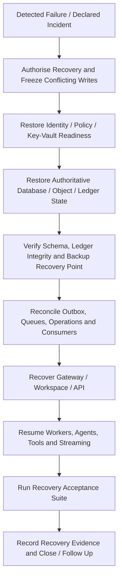

# SPEC-PLATFORM-011 — High-Availability & Disaster Recovery Layer

| Field | Value |
|---|---|
| **Status** | **APPROVED** — approved by the Project Sponsor on 2026-08-24T17:50:05Z |
| **Specification version** | `0.1.0` |
| **Priority** | Cross-cutting P1/P2 resilience foundation |
| **Owning bounded context** | Platform Resilience |
| **Primary outcome** | Maintain safe service continuity and recover governed platform state from component, availability-zone, regional and data-corruption failures through tested, evidence-backed recovery procedures. |
| **Approval record** | `APPROVAL-HA-001`; Project Sponsor instruction; 2026-08-24T17:50:05Z |
| **Dependencies** | `SPEC-PLATFORM-004`, `SPEC-PLATFORM-005`, `SPEC-PLATFORM-007`, `SPEC-PLATFORM-009`, `SPEC-PLATFORM-010`, deployment/runtime and data-storage architecture |

---

## 1. Intent and boundary

High availability and disaster recovery are not a promise of zero downtime or zero data loss. They are a controlled, measurable capability to keep critical functions available where justified, protect recoverable data, make safe failover decisions, and restore service without bypassing governance, evidence or security controls.

> **Recovery truth rule:** A recovery is complete only when the platform has restored the required data/services, validated integrity and policy posture, reconciled critical event/outbox state, and recorded recovery evidence. A process restart, traffic shift or backup copy alone is not proof of recovery.

### 1.1 In scope

| Capability | Required behaviour |
|---|---|
| **Criticality and objectives** | Classify services/data by criticality; define approved Recovery Time Objective (RTO), Recovery Point Objective (RPO), availability target and dependencies for each tier. |
| **Failure-domain design** | Model component, node/process, availability-zone, region, identity/provider, storage, queue and operator failure domains; avoid untested single points of failure. |
| **Data protection** | Define encrypted, access-controlled, recoverable backups/snapshots and point-in-time recovery for authoritative databases, object/evidence data, configuration and recovery metadata. |
| **Recovery orchestration** | Provide ordered runbooks for component restart, service failover, regional recovery, point-in-time restore and rebuild from authoritative artefacts. |
| **Integrity and reconciliation** | Validate ledger integrity, schema/version compatibility, identity/policy/Vault readiness, outbox/consumer reconciliation and resource/evidence linkage after recovery. |
| **Safe degradation** | Enter truthful degraded/blocked state when policy, Vault, Ledger, authoritative data or required dependencies are unavailable; do not silently permit unsafe writes or privileged actions. |
| **Testing and exercises** | Execute scheduled recovery drills, restore tests, failover simulations and game days using documented success criteria and evidence. |
| **Governance and evidence** | Require authorised incident/recovery control, separation of duties for destructive restore/failover where policy requires, and immutable recovery/exercise evidence. |

### 1.2 Out of scope

The draft does not select cloud vendors, regions, database engines, multi-provider topology, specific RTO/RPO values, production backup schedules, automated regional failover, customer data migration, or actual incident execution. It does not treat a local sandbox or a single persistent process as a production HA/DR solution.

---

## 2. Service tiers, objectives and invariants

| Tier | Examples | Required design posture |
|---|---|---|
| **Tier 0 — Control and trust** | Identity/policy enforcement, Vault/key dependency, Ledger integrity, authoritative database metadata. | Fail-safe behaviour; explicit RTO/RPO and recovery validation; no bypass of policy or secret boundary. |
| **Tier 1 — Core product** | Gateway, Workspace/Specification core, API contract, durable operation state. | Redundant/recoverable deployment with bounded degraded mode and tested restore. |
| **Tier 2 — Execution and delivery** | Workers, agents, tools, extensions, streaming, notifications. | Resumable/durable task semantics, queue/outbox reconciliation, safe restart and controlled backpressure. |
| **Tier 3 — Operational insight** | Telemetry exploration, dashboards, non-critical derived projections. | Recoverable without becoming authoritative; loss/degradation cannot alter engineering truth. |

RTO and RPO values are **not yet set**. Every Tier 0–2 component must receive approved values in its recovery profile before production launch. RTO measures the allowed elapsed recovery time; RPO measures the tolerated recovery point relative to authoritative committed data. Availability targets do not excuse data-integrity, policy or evidence failure.

### 2.1 Mandatory invariants

| ID | Invariant |
|---|---|
| **INV-HA-001** | Every production component and authoritative data class has an owner, tier, dependencies, failure domains, approved RTO/RPO, backup/recovery method and tested recovery evidence. |
| **INV-HA-002** | Backups are encrypted, integrity-checked, access-controlled, versioned and independently restorable; backup success is not assumed without restore verification. |
| **INV-HA-003** | Recovery restores authoritative state first and validates schema, ledger chain, identity/policy, Vault/key access and outbox/consumer position before normal writes are enabled. |
| **INV-HA-004** | A failure of required policy, Vault, Ledger or authoritative data causes explicit degraded/blocked behaviour for affected sensitive actions; no emergency implicit allow. |
| **INV-HA-005** | Failover and restore are idempotent, fenced against split-brain/conflicting writers, authorised and correlated to an incident/recovery record. |
| **INV-HA-006** | Durable task, outbox and stream recovery preserves at-least-once/reconciliation semantics; it does not claim exactly-once execution after failure. |
| **INV-HA-007** | Recovery acceptance requires data-integrity, security posture, access, functional smoke, queue/outbox and evidence checks—not only infrastructure health. |
| **INV-HA-008** | Exercises and actual recovery events write safe immutable evidence, including objective achieved/missed, scope, approvals, actions, validation results and follow-up risks. |

---

## 3. Recovery architecture and ordering

### 3.1 Recovery modes

| Mode | Trigger | Required control |
|---|---|---|
| **Component recovery** | Process/node/runtime failure. | Restart or replace stateless component; reattach safe context; observe health. |
| **Service failover** | Availability-domain failure with prepared secondary capability. | Fence active writer, promote authorised standby, validate dependency and traffic state. |
| **Point-in-time restore** | Data corruption or unsafe write. | Authorised restore to defined recovery point; reconcile subsequent events/outbox; retain forensic evidence. |
| **Regional/site recovery** | Region-wide/service-provider failure. | Execute declared recovery plan and restore ordered control/data services before execution layers. |
| **Rebuild from artefacts** | Derived projection/runtime loss. | Rebuild from authoritative database, Ledger/outbox, schemas and approved configuration; do not invent records. |

---

## 4. Functional requirements

| ID | Requirement | Priority |
|---|---|---|
| **FREQ-HA-001** | The system shall maintain a recovery profile for each production component/data class, including tier, owner, dependencies, failure domains, RTO/RPO, backup method, restore runbook and exercise evidence. | MUST |
| **FREQ-HA-002** | The system shall produce encrypted, access-controlled, integrity-verified, versioned backups/snapshots for authoritative databases, object/evidence data, configuration and recovery metadata. | MUST |
| **FREQ-HA-003** | The system shall provide authorised, idempotent, fenced runbooks for component recovery, failover, point-in-time restore, regional recovery and projection rebuild. | MUST |
| **FREQ-HA-004** | The system shall restore and verify trust/control dependencies, authoritative data and Ledger integrity before enabling normal sensitive writes or privileged execution. | MUST |
| **FREQ-HA-005** | The system shall reconcile durable task, queue, outbox, consumer, streaming and operation state after failover/restore using declared at-least-once semantics. | MUST |
| **FREQ-HA-006** | The system shall expose truthful degraded, blocked, restoring, validating and recovered service states through API/telemetry/evidence. | MUST |
| **FREQ-HA-007** | The system shall run and evidence scheduled restore drills, recovery exercises and chaos/failure simulations against approved success criteria. | MUST |
| **FREQ-HA-008** | The system shall record authorised incident/recovery actions, approvals, validation results, objective outcomes and follow-up risks in the Ledger. | MUST |

---

## 5. Backup, security and exercise controls

| Control | Required behaviour |
|---|---|
| **Backup scope** | Authoritative relational/state data, object/evidence payloads, schema/migration history, policy/configuration metadata, recovery manifests and required keys/metadata under Vault/KMS boundary. |
| **Backup access** | Minimum privileged service identity; no routine operator plaintext access; recovery access is purpose-bound and audited. |
| **Immutability and retention** | Versioned and protected according to data/classification policy; retention policy must not remove the only restorable authoritative copy. |
| **Restore environment** | Isolated/restricted where possible; restoration cannot accidentally send production events, credentials or external side effects. |
| **Failover fencing** | Prevent old and new primary writers from accepting conflicting writes; retain write-ahead/reconciliation evidence. |
| **Exercise cadence** | Set by approved tier policy; test component restore, data restore, failover, corruption recovery and full control-plane recovery. |
| **Evidence** | Recovery record includes declared scope, objective, recovery point, approver, runbook version, actions, validation, achieved RTO/RPO, gaps and corrective specification links. |

---

## 6. Acceptance and verification plan

| ID | Given | When | Then | Verification type |
|---|---|---|---|---|
| **AC-HA-001** | A Tier 0–2 recovery profile. | Launch review occurs. | It has owner, dependencies, approved objectives, runbook, backup/recovery method and recent exercise evidence. | Review |
| **AC-HA-002** | A verified backup. | Restore test runs in controlled environment. | Restored state passes schema, integrity, access and functional checks; evidence reports actual recovery point/time. | End-to-end |
| **AC-HA-003** | Component/availability-domain failure. | Failover runbook is invoked. | Writer fencing prevents split-brain; service reaches truthful recovering/degraded/recovered state. | Resilience |
| **AC-HA-004** | Point-in-time restore is authorised after corruption. | Data is restored. | Ledger/integrity and outbox/consumer reconciliation identify/resume safe work without inventing truth. | End-to-end |
| **AC-HA-005** | Policy, Vault or Ledger dependency is unavailable. | Sensitive action is requested. | System denies/blocks safely and publishes correlated degraded-state evidence. | Security |
| **AC-HA-006** | Agent/tool/stream work is interrupted. | Runtime recovers. | Work is reconciled under at-least-once semantics with bounded duplicate/compensation evidence. | Integration |
| **AC-HA-007** | Exercise concludes. | Acceptance suite completes. | Recovery evidence records objective result, checks, gaps and corrective action references. | Review |

---

## 7. Accepted design risks and child specifications

| ID | Question / child specification | Current status and mandatory gate |
|---|---|---|
| **QUESTION-HA-001** | What RTO/RPO, availability, data classification and recovery-tier objectives apply to each initial service/data class? | **ACCEPTED_RISK** — resolve through business-risk policy before production launch. |
| **QUESTION-HA-002** | Which storage/database/queue/deployment topology provides required redundancy, backup, restore and fencing capabilities? | **ACCEPTED_RISK** — resolve through resilience architecture ADR before implementation. |
| **QUESTION-HA-003** | What exercise cadence, incident authority, break-glass/recovery approval and communication policy applies? | **ACCEPTED_RISK** — resolve through security/operations governance before recovery execution is enabled. |
| **SPEC-HA-001** | Recovery profile, dependency graph, component-tier and failure-domain schema. | Required before launch review. |
| **SPEC-HA-002** | Backup, restore, point-in-time recovery, integrity and data-reconciliation protocol. | Required before data onboarding. |
| **SPEC-HA-003** | Failover, fencing, degraded-state and traffic/control-plane recovery contract. | Required before HA deployment. |
| **SPEC-HA-004** | Recovery exercise, incident evidence and corrective-action workflow. | Required before production launch. |
| **ADR-HA-001** | Deployment, storage, backup, failover and recovery topology. | Required before implementation. |

---

## 8. Approval record and implementation authorisation

The Project Sponsor approved `SPEC-PLATFORM-011` version `0.1.0` on **2026-08-24T17:50:05Z**. This approval authorises detailed recovery profiles, runbooks, integrity/reconciliation, exercise and evidence design only. It does not authorise backup/failover deployment, RTO/RPO commitments, regional activation, production restore, traffic cutover, destructive data recovery, incident execution or automated recovery until recovery objectives, topology, authority and child contracts are approved.

---

## References

[1] [SPEC-PLATFORM-004 — Event-Driven Audit & Evidence Ledger](file:///Users/mohankrishnagundala/Documents/Agastya/specifications/SPEC-PLATFORM-004.md)
[2] [SPEC-PLATFORM-005 — Secure Credential & Secret Vault Layer](file:///Users/mohankrishnagundala/Documents/Agastya/specifications/SPEC-PLATFORM-005.md)
[3] [SPEC-PLATFORM-009 — Enterprise Security & RBAC Governance Layer](file:///Users/mohankrishnagundala/Documents/Agastya/specifications/SPEC-PLATFORM-009.md)
[4] [SPEC-PLATFORM-010 — Observability, Telemetry & Distributed Tracing Layer](file:///Users/mohankrishnagundala/Documents/Agastya/specifications/SPEC-PLATFORM-010.md)
