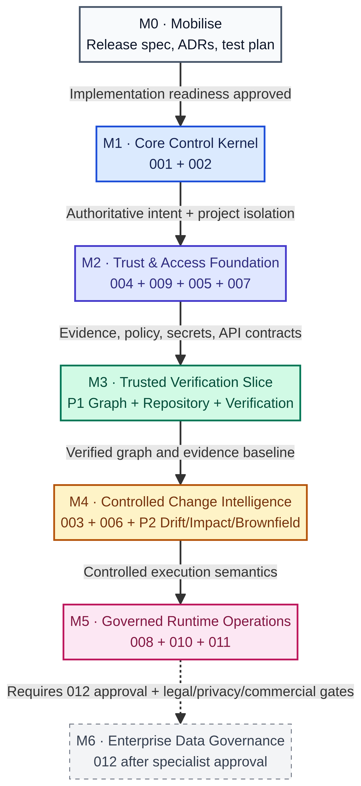

# AGASTYA — High-Level Implementation Roadmap & Milestone Plan

| Field | Value |
|---|---|
| **Status** | Proposed implementation roadmap |
| **Scope** | Approved `SPEC-PLATFORM-001` through `SPEC-PLATFORM-011`, with `SPEC-PLATFORM-012` shown as a gated future overlay |
| **Planning basis** | Approved platform specifications, released dependency map, existing P0 roadmap, and P0-A–D sprint estimate |
| **Planning principle** | Deliver **authoritative intent first**, then **policy and evidence**, then **verification**, then **controlled execution**, then **operational resilience and enterprise governance**. |
| **Important constraint** | This is a dependency-led plan, not a calendar commitment. Milestones advance only with their explicit technical, security, and evidence gates satisfied. |

> **Roadmap thesis:** AGASTYA should be built in the same way it governs engineering work: every milestone begins from an approved specification, is implemented through bounded contracts, is independently verified, and produces durable evidence of completion. [1]

## 1. Executive implementation path

The approved suite establishes a clear control dependency: `001 → 002 → 004 → 009 → 005 → 007 → 003 → 006 → 008 → 010 → 011`. Specifications and project isolation must exist before evidence, policy, secrets, interfaces, agent execution, real-time delivery, telemetry, or recovery controls are enabled. `SPEC-PLATFORM-012` is deliberately held outside this path until specialist approval. [2]

| Milestone | Strategic result | Primary specifications and product scope |
|---|---|---|
| **M0 — Mobilise** | Implementation becomes governed and executable. | Release specification, child contracts, ADRs, test specifications, threat model, and delivery environment. |
| **M1 — Core Control Kernel** | Teams can create, validate, approve, version, diff, and audit a project-scoped specification. | `001`, `002`; P0 workstreams A–D, followed by E–G completion. |
| **M2 — Trust & Access Foundation** | Material platform actions have policy, evidence, secure secret handling, and stable internal interfaces. | `004`, `009`, `005`, `007`. |
| **M3 — Trusted Verification Slice** | A bounded repository change can be traced from approved specification to verification evidence and an explainable result. | P1 graph, read-only repository link, executable contracts, Verification Engine v1, Evidence Fabric v1, SRS v1. |
| **M4 — Controlled Change Intelligence** | AGASTYA can assess a proposed change, detect reliable drift, and coordinate bounded AI-assisted implementation. | `003`, `006`; P2 impact, drift, brownfield, CI and release-readiness capabilities. |
| **M5 — Governed Runtime Operations** | Platform services operate with authorised real-time delivery, safe telemetry, and recovery design exercised as governed work. | `008`, `010`, `011`. |
| **M6 — Enterprise Data Governance** | The control plane extends to residency and data lifecycle decisions. | `012`, only after approval and specialist gates. |

## 2. Milestone plan

### M0 — Mobilise the governed delivery system

M0 should not be treated as generic project setup. Its purpose is to make the implementation programme itself traceable and safe before runtime code proliferates. The existing approved designs are sufficient to begin the specification and contract pack, but infrastructure, provider, identity, security and operations choices remain intentional decision gates. [3]

| Entry criteria | Core deliverables | Exit criteria |
|---|---|---|
| `001` and `002` are approved; product owner and technical owner are named. | `RELEASE-IMPL-001`; child API, lifecycle, data-model, identity, audit and testing contracts; ADR register; threat model; Definition of Done; CI baseline. | Each M1 work item has a parent spec, owner, acceptance criteria, risk class, contract/test reference and evidence path. No provider, secret, identity or persistence decision remains implicit. |

**Recommended ownership focus:** product/specification owner, platform architect, security representative, and the first backend/platform engineer. This milestone should create decisions and executable boundaries, not production services.

### M1 — Deliver the Core Control Kernel

M1 is the first usable AGASTYA product increment. It combines the Canonical Specification Core and Workspace Boundary so that an authorised user can create a project, author a governing specification, validate it, secure approval, create a later revision, compare changes, and recover the exact approved version. [1] [4]

| Workstream | Scope | Completion evidence |
|---|---|---|
| **Foundation controls** | Module boundaries, CI, typed configuration, correlation/idempotency conventions, and foundational ADRs. | Commit-SHA quality checks and enforcement proving UI/API paths cannot bypass the domain layer. |
| **Workspace and authorisation** | Project/membership persistence, Owner–Editor–Viewer policy, verified principal context, project isolation and last-Owner protection. | Cross-project read/write/approval denial matrix and audit evidence. |
| **Schema and validation** | Registry, canonicalisation/hash, structural/semantic validation, immutable findings and common validation API/CLI contract. | Deterministic findings against exact revisions and valid current canonical instances. |
| **Lifecycle and approval** | Copy-on-write revisions, semantic versioning, atomic approval, rejection, supersession and deterministic diff. | Stale or blocker-bearing revisions cannot become active; successful approval is immutable and reconstructable. |

**Known planning anchor.** The existing estimate for P0-A through P0-D is **36.5 ideal engineering days**, plus **7.3 days of risk reserve**, or **43.8 ideal engineering days**. With one senior full-stack engineer at ten ideal days per two-week sprint, this represents four implementation sprints and one protected contingency/integration sprint. It excludes the P0-E through P0-G audit/evidence expansion, API/CLI/Studio completion, and broad release-hardening work, which should be estimated during M0. [5]

**M1 exit gate:** a pilot user completes the thin vertical slice `project → draft → validate → approve → revise → diff → retrieve through UI, API and CLI`, with automated essential-flow tests and immutable audit evidence. [1]

### M2 — Establish the Trust & Access Foundation

M2 implements cross-cutting controls before AI execution, external integrations, or public interface exposure expands. The Evidence Ledger becomes the durable proof substrate; RBAC becomes the common policy decision and enforcement layer; Vault supports opaque purpose-bound secret leases; and Gateway exposes a secure, versioned internal boundary. [2] [3]

| Component | Minimum implementation outcome | Gate before progressing |
|---|---|---|
| **004 Evidence Ledger** | Append-only material events, integrity verification, transactional outbox and replayable projections. | Decision/event reconstruction, supersession correctness and idempotent consumer evidence. |
| **009 RBAC Governance** | Scoped roles, contextual policy decisions, policy enforcement points, separation-of-duties and non-human identity rules. | Deny-by-default tests at all active enforcement points; no ungoverned privileged path. |
| **005 Secret Vault** | Metadata/secret separation, provider-backed encryption boundary, revocation and short-lived purpose-bound leases. | Secrets never reach agent context, logs, Ledger payloads, client responses or ordinary tool output. |
| **007 API Gateway** | Contract-first internal API, exact project scope, idempotency, concurrency controls, standard errors and operation resources. | Contract tests prove consistent policy, correlation and evidence attachment for material commands. |

**M2 exit gate:** the platform can prove who performed each material action, which policy permitted it, what authoritative resource changed, which evidence was recorded, and whether a secret or capability was involved—without exposing secret material. [3]

### M3 — Prove the Trusted Verification Slice

M3 is the P1 product proof point. It should connect one repository in read-only mode, model a deliberately limited relationship graph, link an approved specification to requirements, contracts, code units and tests, execute a bounded verification run, retain evidence, and calculate an explainable, evidence-backed SRS. [1]

| Delivery lane | First safe scope | Exit evidence |
|---|---|---|
| **Repository and graph** | One Git provider, one repository, versioned artifact identities and a limited set of traceability relationships. | Requirement-to-code-to-test-to-evidence and reverse traversal are demonstrable. |
| **Executable specification** | OpenAPI/JSON Schema contract checks plus a small behaviour/acceptance format. | One contract and one behaviour-derived test run against a reference service. |
| **Verification and evidence** | Async run lifecycle, expected/observed behaviour, rule/version/status and immutable evidence attachment. | Passing, failing and blocked results persist against exact specification and implementation versions. |
| **SRS v1** | Measured requirement coverage, contract compliance, test evidence, traceability and freshness only. | Formula, sources, unknown dimensions and confidence are visible; no score dimension is fabricated. |

**M3 exit gate:** an intentionally introduced behavioural or contract defect is detected and explained through `approved specification → linked artifact → verification failure → immutable evidence → SRS movement`. An LLM assertion or manually entered status cannot be displayed as verification. [1]

### M4 — Deliver Controlled Change Intelligence

M4 is the flagship P2 differentiation milestone. It converts the verified graph into an impact, drift and controlled execution capability. Agent functionality remains bounded: it receives a specific task, approved context, policy-scoped capability and an explicit approval model; it does not receive unrestricted production or repository authority. [1] [3] [6]

| Capability | First implementation scope | Non-negotiable control |
|---|---|---|
| **Impact analysis** | Traverse from an approved specification change to known affected rules, contracts, code units, tests and controls. | Unknown or incomplete coverage is reported, not hidden. |
| **Drift detection** | Rule-based specification, contract, test, documentation and architecture findings. | Each finding links to reproducible rule, source and severity. |
| **Brownfield intelligence** | Repository inventory and proposed—not authoritative—specification/graph content. | A human must approve, reject or edit every proposed assertion. |
| **Orchestration and tools** | Durable plans/tasks, policy-before-dispatch, signed internal read-only tools, approvals and execution evidence. | No external provider, write-capable tool or secret-backed action proceeds without its child gate. |
| **CI and readiness** | Pull-request/pipeline check for selected compliance, evidence and critical drift conditions. | Mandatory evidence or critical drift blocks release readiness. |

**M4 exit gate:** a business-rule change in a reference brownfield system produces an impact report, a bounded proposal/patch through an approved agent task, verification evidence, any residual drift, and a defensible release-readiness decision. [1]

### M5 — Operate the Governed Runtime Safely

M5 adds the operational plane after the system has authoritative state, policy and evidence. Streaming is an authorised notification path, telemetry is safe operational evidence rather than product truth, and resilience is a gated recovery process that restores trust before throughput. [2] [7]

| Component | Implementation outcome | Exit evidence |
|---|---|---|
| **008 Streaming** | Authorised project channels, short-lived connection tickets, bounded replay, backpressure and explicit resynchronisation. | A client reconnects safely and re-reads the authoritative API state after `RESYNC_REQUIRED`. |
| **010 Observability** | Common correlation context across API, policy, queue, agent, tool, Vault, Ledger and streaming; safe telemetry classification. | A representative material action can be traced end-to-end without recording restricted payloads. |
| **011 HA/DR** | Tiered recovery profile, encrypted restore path, reconciliation, recovery authority and exercise evidence. | A controlled recovery exercise re-establishes policy, keys, authoritative state and Ledger integrity before normal writes resume. |

**M5 exit gate:** failure injection and recovery tests demonstrate that task/evidence state is not silently lost or corrupted, operational evidence is correlated and safe, and real-time clients never become a source of authoritative state. [2] [7]

### M6 — Activate Enterprise Data Governance After Specialist Approval

`SPEC-PLATFORM-012` is a draft and is deliberately a future overlay rather than an implementation prerequisite for the earlier product proof points. It must not be interpreted as legal advice, certification, a data-residency promise, or a production-policy authorisation. [3]

| Entry gate | Implementation focus | Exit evidence |
|---|---|---|
| Qualified legal, privacy, security, commercial and architecture stakeholders approve `012` and its child contracts. | Inventory-backed classification; residency profile; processor/egress enforcement; retention, hold, deletion and recovery-reactivation policy. | Tenant policy decisions, exceptions, data-flow evidence and deletion/recovery records are reviewable and scope-qualified. |

## 3. Cross-milestone workstreams

The milestone sequence should be delivered through stable workstreams, rather than creating isolated teams around every specification number. The following model keeps control responsibilities clear while allowing parallel design and test preparation.

| Workstream | Accountable outcome | Active milestones |
|---|---|---|
| **Specification and product governance** | Release specs, child contracts, acceptance criteria, approval gates and traceability. | M0–M6 |
| **Core domain and persistence** | Canonical model, workspace isolation, revisions, lifecycle, evidence records and graph relationships. | M1–M4 |
| **Security and policy** | RBAC/ABAC policy, Vault integration, privileged-action controls, tool permissions and compliance overlay. | M0–M6 |
| **Verification and intelligence** | Repository links, graph, contract checks, Verification Engine, SRS, drift, impact and brownfield proposals. | M3–M4 |
| **Developer experience and integrations** | Studio, API, CLI, SDK, CI checks, event/streaming client experience and adapters. | M1–M5 |
| **Platform operations** | Async execution, telemetry, SLOs, backup/recovery, exercises and operations evidence. | M2–M5 |

## 4. Release gates that must remain explicit

| Gate | Applies before | Decision owner(s) |
|---|---|---|
| **Authoritative data-model and lifecycle ADRs** | M1 persistence and approval implementation. | Platform architect and product/specification owner. |
| **Identity and policy contracts** | M2 enforcement at Gateway, Vault, agents, tools and streaming. | Security owner and platform architect. |
| **Provider and runtime ADRs** | Any external model, queue, secret-provider, telemetry-provider or persistent runtime use. | Architecture, security and operations owners. |
| **Tool and agent capability approval** | M4 external execution, write actions, secret-backed actions or pull-request creation. | Product/specification owner, security owner and designated approver. |
| **Operational objective approval** | M5 production SLOs, RTO/RPOs, retention, alerting, failover and recovery exercises. | Operations owner plus business-risk owner. |
| **Data governance approval** | M6 residency, processor, egress, retention, deletion or legal-hold activation. | Legal, privacy, security, commercial and architecture stakeholders. |

## 5. Outcome metrics and steering cadence

Progress should be assessed as verified outcomes—not ticket count, code volume or agent activity. A milestone review should occur at each exit gate and should inspect both the working product and its evidence package. [1]

| Metric | M1 target | M3 target | M4 target | M5 target |
|---|---|---|---|---|
| **Approved scope coverage** | 100% of active scope has approved parent specification. | Same. | Same. | Same. |
| **Automated acceptance evidence** | At least 80% of M1 acceptance criteria. | At least 85%. | At least 90%. | At least 95%. |
| **Traceability depth** | Specification to acceptance and evidence. | Requirement to code/test/evidence. | Change impact and agent-task lineage. | Runtime and recovery evidence linked to intent. |
| **Critical ungoverned changes** | 0 | 0 | 0 | 0 |
| **Actions outside policy** | 0 | 0 | 0 | 0 |

## 6. First 30-day recommendation

The immediate execution focus should be **M0 plus the M1 thin vertical slice**. Do not open M3–M5 implementation in parallel merely because their designs are approved. In the first delivery window, finish implementation-readiness contracts, establish P0 engineering controls, and demonstrate project-scoped `draft → validate → approve → revise → diff → retrieve` with evidence. This proves that AGASTYA is already operating as the specification-driven control plane it intends to become. [1] [4] [5]

## References

[1] [AGASTYA P0–P3 Specification-Driven Delivery Roadmap](../../AGASTYA_P0_P3_ROADMAP.md)
[2] [Approved Platform Dependency & Data-Flow Map Guide](../maps/AGASTYA_APPROVED_PLATFORM_MAP.md)
[3] [AGASTYA Platform Specification Suite Release Notes](../releases/AGASTYA_SPEC_PLATFORM_001_012_RELEASE_NOTES.md)
[4] [SPEC-PLATFORM-001 — Canonical Specification Core](../SPEC-PLATFORM-001.md)
[5] [P0-A to P0-D Estimated Sprint Backlog](../AGASTYA_P0_A_TO_D_SPRINT_BACKLOG.md)
[6] [SPEC-PLATFORM-003 — Multi-Agent Orchestration Layer](../SPEC-PLATFORM-003.md)
[7] [SPEC-PLATFORM-011 — High Availability & Disaster Recovery Layer](../SPEC-PLATFORM-011.md)
